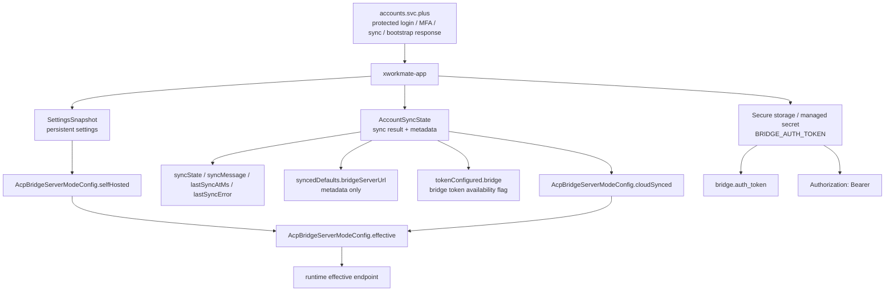
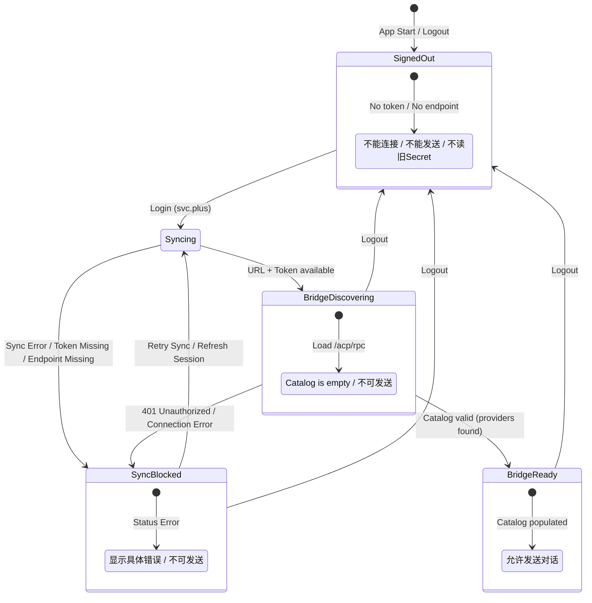
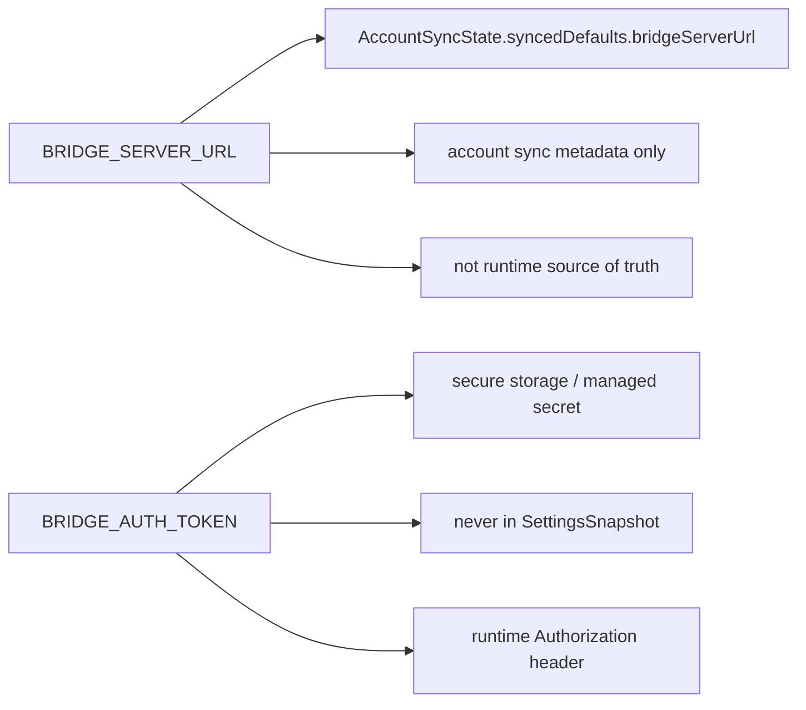
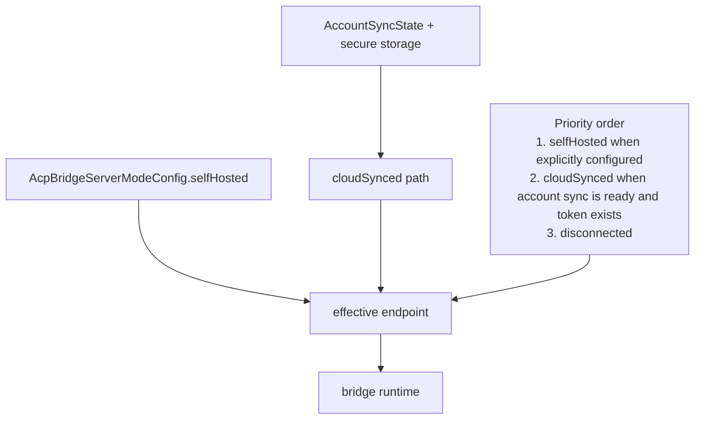

# Account Sync, Settings, and Bridge State Model

Last Updated: 2026-04-21

This document is the canonical state model for:

- `SettingsSnapshot`
- `AccountSyncState`
- `BRIDGE_SERVER_URL`
- `BRIDGE_AUTH_TOKEN`

The goal is to keep three ownership layers distinct:

- **Persistent settings**: user-visible, non-secret configuration
- **Account sync metadata**: sync outcome plus bridge metadata derived from protected account responses
- **Secure secrets**: tokens and other material that must never enter normal settings persistence

## Ownership Model

## State Flow

## Field Semantics

## Runtime Resolution

### Runtime Invariants

- `selfHosted` always wins when it is configured.
- `cloudSynced` is valid only when account sync is ready and the managed bridge token exists.
- Signed-out state is disconnected: runtime must not use a default managed endpoint, stale managed secret, gateway profile token, or loopback ACP endpoint.
- Missing `BRIDGE_AUTH_TOKEN` is disconnected for the managed cloud-sync path.
- `BRIDGE_SERVER_URL` may be retained in `AccountSyncState.syncedDefaults.bridgeServerUrl`, but it is metadata only.
- `BRIDGE_AUTH_TOKEN` is written to secure storage only, never to normal settings.
- Bridge runtime requests use `Authorization: Bearer <token>` from secure storage.
- Capabilities, routing discovery, and assistant execution all use the bridge root `/acp/rpc`.

## Persistence Rules

- `SettingsSnapshot`
  - stores user-facing configuration and bridge mode config
  - stores the effective `AcpBridgeServerModeConfig`
  - must not store `BRIDGE_AUTH_TOKEN`

- `AccountSyncState`
  - stores sync state, timestamps, sync error, and token availability flags
  - stores `BRIDGE_SERVER_URL` as sync metadata only
  - can be persisted safely in secure storage because it contains no raw token

- Secure storage / managed secret
  - stores `BRIDGE_AUTH_TOKEN`
  - is the only place that should hold the bridge authorization token

## Cross-References

- [Bridge Sync Contract Chain](/Users/shenlan/workspaces/cloud-neutral-toolkit/xworkmate-app/docs/testing/bridge-sync-contract-chain.md)
- [Settings Integration Configuration Model](/Users/shenlan/workspaces/cloud-neutral-toolkit/xworkmate-app/docs/architecture/settings-integration-configuration-model.md)
- [Secure Development Rules](/Users/shenlan/workspaces/cloud-neutral-toolkit/xworkmate-app/docs/security/secure-development-rules.md)
