# Assistant Thread Working Directory Flow

更新时间：2026-03-28

> 已过时：本文记录的是 `workspaceRef / workspaceRefKind / cwd fallback` 主导时期的线程目录流转。
>
> 当前实现请优先参考：
> [docs/architecture/task-control-plane-unification.md](/Users/shenlan/workspaces/cloud-neutral-toolkit/xworkmate/docs/architecture/task-control-plane-unification.md)
>
> 新文档已经把 TaskThread 的主流程图和状态图重画为基于 `workspaceBinding / executionBinding / lifecycleState` 的 Mermaid 版本。

本文记录 XWorkmate 中“任务线程独立工作目录”的变量流转关系，重点覆盖：

- UI 选中线程后，当前线程是谁
- 线程记录里哪些字段决定工作目录
- cwd 如何被解析并传给 Single Agent runner
- provider 返回真实线程目录后如何回写
- 右侧边栏如何展示当前任务工作路径

## 流转图

```mermaid
flowchart LR
  A["UI选中线程<br/>controller.switchSession(sessionKey)"] --> B["currentSessionKey"]
  B --> C["按 sessionKey 读取线程记录<br/>assistantThreadRecordsInternal[sessionKey]"]

  C --> D1["workspaceRef"]
  C --> D2["workspaceRefKind"]
  C --> D3["executionTarget"]

  C -->|没有 workspaceRef| E["defaultWorkspaceRefForSessionInternal(sessionKey)"]
  E --> E2["settings.workspacePath + /.xworkmate/threads/<session>"]

  D1 --> F["assistantWorkspaceRefForSession(sessionKey)"]
  E --> F
  D2 --> G["assistantWorkspaceRefKindForSession(sessionKey)"]
  D3 --> G2["defaultWorkspaceRefKindForTargetInternal(target)"]

  F --> H["resolveSingleAgentWorkingDirectoryForSessionInternal(sessionKey, provider)"]
  G --> H
  G2 --> H
  I["provider endpoint<br/>https/wss or local"] --> H

  H -->|localPath 且存在| J["workingDirectory = 本地线程目录"]
  H -->|remotePath| K["workingDirectory = 远端线程目录字符串"]
  H -->|objectStore / 解析失败| L["fallback = Directory.current.path"]

  J --> M["SingleAgentRunRequest.workingDirectory"]
  K --> M
  L --> M

  M --> N["singleAgentRunner.run(...)"]
  N --> O["Direct app-server / CLI / provider"]

  O --> P1["result.resolvedWorkingDirectory"]
  O --> P2["result.resolvedWorkspaceRefKind"]

  P1 --> Q["回写线程记录<br/>upsertAssistantThreadRecordInternal(...)"]
  P2 --> Q

  Q --> R["assistantThreadRecordsInternal[sessionKey] 更新"]

  R --> S["右栏显示<br/>AssistantArtifactSidebar(workspaceRef, workspaceRefKind)"]
  B --> S
```

## 核心变量

### 1. 当前线程

- 变量：`currentSessionKey`
- 作用：决定当前操作命中了哪个任务线程
- 关键位置：
  - [runtime_controllers_gateway.dart](/Users/shenlan/workspaces/cloud-neutral-toolkit/xworkmate/lib/runtime/runtime_controllers_gateway.dart:96)
  - [app_controller_desktop_thread_actions.dart](/Users/shenlan/workspaces/cloud-neutral-toolkit/xworkmate/lib/app/app_controller_desktop_thread_actions.dart:208)

如果 `currentSessionKey` 没切对，后续 `workspaceRef`、`cwd`、右栏路径都会跟着取错。

### 2. 全局基础工作目录

- 变量：`settings.workspacePath`
- 作用：线程默认目录的根目录
- 关键位置：
  - [app_controller_desktop_thread_sessions.dart](/Users/shenlan/workspaces/cloud-neutral-toolkit/xworkmate/lib/app/app_controller_desktop_thread_sessions.dart:571)

默认线程目录由它派生：

`<settings.workspacePath>/.xworkmate/threads/<sanitized-sessionKey>`

关键位置：

- [app_controller_desktop_thread_sessions.dart](/Users/shenlan/workspaces/cloud-neutral-toolkit/xworkmate/lib/app/app_controller_desktop_thread_sessions.dart:560)
- [app_controller_desktop_thread_sessions.dart](/Users/shenlan/workspaces/cloud-neutral-toolkit/xworkmate/lib/app/app_controller_desktop_thread_sessions.dart:576)

### 3. 线程自己的目录绑定

- 变量：`assistantThreadRecordsInternal[sessionKey].workspaceRef`
- 作用：线程级工作目录的真实绑定值
- 关键位置：
  - [app_controller_desktop_thread_sessions.dart](/Users/shenlan/workspaces/cloud-neutral-toolkit/xworkmate/lib/app/app_controller_desktop_thread_sessions.dart:121)

读取优先级：

1. 线程记录里的 `workspaceRef`
2. 默认派生目录 `defaultWorkspaceRefForSessionInternal(sessionKey)`

### 4. 线程目录类型

- 变量：`assistantThreadRecordsInternal[sessionKey].workspaceRefKind`
- 类型：
  - `localPath`
  - `remotePath`
  - `objectStore`
- 关键位置：
  - [app_controller_desktop_thread_sessions.dart](/Users/shenlan/workspaces/cloud-neutral-toolkit/xworkmate/lib/app/app_controller_desktop_thread_sessions.dart:133)

它决定 `workspaceRef` 后续如何参与 cwd 解析。

## 默认目录生成

### 1. 默认目录生成函数

- `defaultWorkspaceRefForSessionInternal(sessionKey)`
- `defaultLocalWorkspaceRefForSessionInternal(sessionKey)`

关键位置：

- [app_controller_desktop_thread_sessions.dart](/Users/shenlan/workspaces/cloud-neutral-toolkit/xworkmate/lib/app/app_controller_desktop_thread_sessions.dart:560)
- [app_controller_desktop_thread_sessions.dart](/Users/shenlan/workspaces/cloud-neutral-toolkit/xworkmate/lib/app/app_controller_desktop_thread_sessions.dart:565)

### 2. 线程目录名

- `threadWorkspaceDirectoryNameInternal(sessionKey)`
- 作用：把 `sessionKey` 变成稳定、可落盘的目录名

关键位置：

- [app_controller_desktop_thread_sessions.dart](/Users/shenlan/workspaces/cloud-neutral-toolkit/xworkmate/lib/app/app_controller_desktop_thread_sessions.dart:581)

## 线程初始化时的写入

新任务创建时，线程上下文初始化会直接写入默认目录：

- `workspaceRef: defaultWorkspaceRefForSessionInternal(normalizedSessionKey)`
- `workspaceRefKind: defaultWorkspaceRefKindForTargetInternal(resolvedTarget)`

关键位置：

- [app_controller_desktop_workspace_execution.dart](/Users/shenlan/workspaces/cloud-neutral-toolkit/xworkmate/lib/app/app_controller_desktop_workspace_execution.dart:261)

这意味着：

- 新线程刚创建时，通常先拿到“默认派生目录”
- 后续如果 provider 返回真实线程目录，才可能再回写成远端目录

## cwd 解析

### 1. 入口

- `resolveSingleAgentWorkingDirectoryForSessionInternal(sessionKey, provider)`

关键位置：

- [app_controller_desktop_runtime_coordination_impl.dart](/Users/shenlan/workspaces/cloud-neutral-toolkit/xworkmate/lib/app/app_controller_desktop_runtime_coordination_impl.dart:183)

### 2. 参与变量

- `assistantWorkspaceRefForSession(sessionKey)`
- `assistantWorkspaceRefKindForSession(sessionKey)`
- `provider`
- provider endpoint 的 scheme / host

### 3. 解析规则

- `objectStore` -> 返回 `null`
- `remotePath` -> 直接返回 `workspaceRef`
- `localPath`
  - 目录存在：返回本地目录
  - 目录不存在且要求必须本地存在：返回 `null`
  - 目录不存在但不强制：返回字符串本身

关键位置：

- [app_controller_desktop_runtime_coordination_impl.dart](/Users/shenlan/workspaces/cloud-neutral-toolkit/xworkmate/lib/app/app_controller_desktop_runtime_coordination_impl.dart:151)
- [app_controller_desktop_runtime_coordination_impl.dart](/Users/shenlan/workspaces/cloud-neutral-toolkit/xworkmate/lib/app/app_controller_desktop_runtime_coordination_impl.dart:160)
- [app_controller_desktop_runtime_coordination_impl.dart](/Users/shenlan/workspaces/cloud-neutral-toolkit/xworkmate/lib/app/app_controller_desktop_runtime_coordination_impl.dart:183)

## provider 对 cwd 的影响

### 1. 是否必须是本地目录

- `singleAgentProviderRequiresLocalPathRuntimeInternal(provider)`

关键位置：

- [app_controller_desktop_runtime_coordination_impl.dart](/Users/shenlan/workspaces/cloud-neutral-toolkit/xworkmate/lib/app/app_controller_desktop_runtime_coordination_impl.dart:206)

规则简述：

- `https` / `wss` 远端 provider：不强制本地路径存在
- loopback / 本地 provider：通常要求本地目录

## runner 前的最后兜底

如果上面的解析结果是 `null`，发送给 Single Agent 时会退回：

- `Directory.current.path`

关键位置：

- [app_controller_desktop_single_agent.dart](/Users/shenlan/workspaces/cloud-neutral-toolkit/xworkmate/lib/app/app_controller_desktop_single_agent.dart:140)

这就是“任务线程没有有效目录时，命令最后跑到全局/容器 cwd”的直接原因。

## provider 结果回写

Single Agent 运行后可能返回：

- `result.resolvedWorkingDirectory`
- `result.resolvedWorkspaceRefKind`

关键位置：

- [app_controller_desktop_single_agent.dart](/Users/shenlan/workspaces/cloud-neutral-toolkit/xworkmate/lib/app/app_controller_desktop_single_agent.dart:155)

当前逻辑中：

- 当返回了非空 `resolvedWorkingDirectory`
- 且 `resolvedWorkspaceRefKind == remotePath`
- 会回写到当前线程的 `assistantThreadRecord`

这样第二次开始，线程就能稳定复用 provider 返回的真实目录。

## 线程目录同步逻辑

### 1. 同步入口

- `syncAssistantWorkspaceRefForSessionInternal(sessionKey)`

关键位置：

- [app_controller_desktop_thread_sessions.dart](/Users/shenlan/workspaces/cloud-neutral-toolkit/xworkmate/lib/app/app_controller_desktop_thread_sessions.dart:709)

### 2. 它什么时候会改目录

会基于：

- `defaultWorkspaceRefForSessionInternal(sessionKey)`
- `defaultWorkspaceRefKindForTargetInternal(target)`
- `shouldMigrateWorkspaceRefInternal(...)`

来判断是否要把线程目录重新同步成默认派生值。

关键位置：

- [app_controller_desktop_thread_sessions.dart](/Users/shenlan/workspaces/cloud-neutral-toolkit/xworkmate/lib/app/app_controller_desktop_thread_sessions.dart:649)
- [app_controller_desktop_thread_sessions.dart](/Users/shenlan/workspaces/cloud-neutral-toolkit/xworkmate/lib/app/app_controller_desktop_thread_sessions.dart:709)

### 3. 典型迁移触发

- `workspaceRef` 为空
- 指向旧共享根目录
- 指向另一个 root 下的旧默认线程目录
- 本地目录不存在

## 右侧边栏显示

右侧边栏不决定 cwd，只负责展示：

- `workspaceRef`
- `workspaceRefKind`

传入位置：

- [assistant_page_state_closure.dart](/Users/shenlan/workspaces/cloud-neutral-toolkit/xworkmate/lib/features/assistant/assistant_page_state_closure.dart:317)

渲染位置：

- [assistant_artifact_sidebar.dart](/Users/shenlan/workspaces/cloud-neutral-toolkit/xworkmate/lib/widgets/assistant_artifact_sidebar.dart)

因此右栏显示“未设置”或显示某个路径，本质上反映的是当前线程记录里到底有没有有效 `workspaceRef`。

## 最关键的四个变量

如果只看“谁最直接影响任务线程独立工作目录”，优先级最高的是这四个：

1. `currentSessionKey`
2. `assistantThreadRecordsInternal[sessionKey].workspaceRef`
3. `assistantThreadRecordsInternal[sessionKey].workspaceRefKind`
4. `settings.workspacePath`

## 最关键的两个回退口

如果目标是“任务线程必须严格使用独立目录，不允许悄悄落回全局目录”，最值得做取舍的是这两个点：

1. `defaultWorkspaceRefForSessionInternal(...)`
   - 线程没绑定目录时，是否允许自动派生一个默认目录
2. `Directory.current.path`
   - cwd 解析失败时，是否允许最后再退到进程当前目录

这两个点决定了系统是：

- “尽量可运行，但可能回退到全局目录”
- 还是
- “没有线程目录就禁止运行，必须先绑定正确目录”
