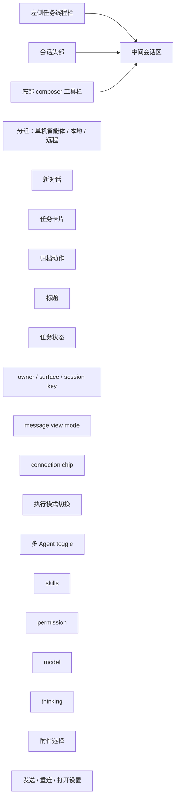

# Assistant 任务线程信息架构

本文分为两部分：

- 当前已实现的线程信息架构基线
- 尚未落地、只应视为未来扩展方向的 IA 目标

这份文档不再把未来目标写成“当前 UI 已实现”。

## 目标

`XWorkmate` 的 Assistant 已经采用“任务即线程”的基本模型，目标是让以下状态尽量按线程隔离：

- 会话历史
- 执行模式
- skills
- 模型
- 顶部连接状态
- 线程标题 / 归档状态

同时需要明确哪些能力当前还没有做成线程级持久化。

## 当前已实现基线

### 核心原则

1. 一个任务对应一个 `AssistantThreadRecord`
2. `executionTarget`、`selectedSkillKeys`、`assistantModelId`、`messageViewMode` 跟线程走
3. 右上角 connection chip 只反映当前线程的解析结果，不直接沿用别的线程状态
4. 全局设置只提供默认值，不直接覆盖已有线程

### 当前页面结构

当前没有独立落地的右侧“线程上下文抽屉”。

## 当前 UI 真实分布

### 1. 左侧：任务线程栏

当前已实现：

- 任务按 `AssistantExecutionTarget` 分组显示
- 支持新建线程
- 支持切换线程
- 支持归档线程
- 任务卡片显示标题、状态、更新时间

当前未实现：

- 线程导出
- 线程模板
- 线程级自动化入口

### 2. 会话头部

当前头部显示的是：

- 当前线程标题
- 当前任务状态 pill
- owner
- surface
- session key
- message view mode
- connection chip

当前没有把以下信息集中放到头部：

- 单独的 skills 数
- 单独的模型标签
- 独立的模式标签字段

这些能力目前主要在底部 composer 工具栏里呈现；模式语义则通过 connection chip 和执行模式按钮共同体现。

### 3. 中间：会话内容区

当前已实现：

- 渲染当前线程的消息历史
- 渲染本地任务卡片 / tool call / assistant message
- 流式结果回到当前线程
- 切线程后按当前线程重新解析内容来源

### 4. 底部：输入与执行区

当前已实现：

- 执行模式切换
- skills 选择
- 模型选择
- 权限等级
- reasoning 选择
- 附件选择
- 提交 / 停止 / 重连 / 打开设置

也就是说，当前“模型”和“skills”不是头部状态栏字段，而是 composer toolbar 字段。

### 5. 右侧上下文抽屉

当前状态：

- 独立的“线程上下文抽屉”没有落地为已交付能力
- 文档里提到的 `线程配置 / 已选技能 / 附件 / 运行历史 / 导出` 目前不应视为已实现 UI

## 当前线程隔离矩阵

| 维度 | 当前状态 | 说明 |
| --- | --- | --- |
| 消息历史 | 是 | 每个线程独立保存 / 解析历史 |
| 执行模式 | 是 | `Single Agent / Local / Remote` 跟线程绑定 |
| Skills | 是 | 当前线程可用 / 已选 skills 跟线程绑定 |
| 模型 | 是 | `assistantModelId` 跟线程绑定，没设时回退到默认模型 |
| 顶部连接状态 | 是 | 只显示当前线程解析出的连接状态 |
| message view mode | 是 | 跟线程绑定 |
| 自定义标题 | 是 | 通过 settings 持久化 |
| 归档状态 | 是 | 通过 settings 持久化 |
| 草稿输入 | 否 | 当前只有页面级 `_inputController` |
| 发送前附件草稿 | 否 | 当前只有页面级 `_attachments` |
| 导出 | 否 | 未实现 |

## 线程工作目录与 WorkspaceRefKind（当前实现）

### 统一线程工作目录规则

当前 Desktop 实现中，所有线程（含 `main`）统一使用：

`workspacePath/.xworkmate/threads/<SessionKey>`

其中：

- `<SessionKey>` 会经过目录名安全化（非法字符替换）
- 目录不存在时会自动创建
- 线程切换与恢复时，如发现旧记录目录缺失或仍指向共享根目录，会自动迁移到该统一目录

### `workspaceRefKind` 的语义（与路径解耦）

`workspaceRefKind` 用来表达运行通道语义，而不是决定目录拼接规则：

- 本地 Agent（`singleAgent`）=> `localPath`
- OpenClaw Gateway（`local` / `remote`）=> `remotePath`

注意：即使 `workspaceRefKind = remotePath`，线程目录仍然按统一规则落在  
`workspacePath/.xworkmate/threads/<SessionKey>`。

### 已清理的旧行为

以下旧行为不再作为当前实现：

- `main` 线程直接使用 `workspacePath` 根目录
- 通过 `remoteProjectRoot` 单独决定线程目录
- Single Agent runner 返回 `resolvedWorkingDirectory` 后覆盖线程目录

## 当前交互规则

### 新建线程

当前实现：

- 新线程继承当前线程的 `executionTarget`
- 新线程继承当前线程的 `messageViewMode`
- 不继承上一线程的消息历史

当前未实现：

- 创建时可选继承当前线程已选 skills
- 线程级输入草稿继承

### 切换线程

当前会同步切换：

- 当前模式
- 当前 skills
- 当前模型
- 当前顶部连接状态
- 当前消息内容解析路径

当前不会恢复线程级输入草稿，因为这项能力还没有实现。

### 切模式

当前实现：

- 模式切换默认只影响当前线程
- 同时允许更新 `settings.assistantExecutionTarget` 作为默认新线程模式
- 切换后会按线程目标重连 / 断连 runtime，并刷新 skills / connection state

## 当前实现与未来目标的边界

下面这些描述只应视为未来扩展方向，不能再当成“当前 UI 已实现”：

- 右侧线程上下文抽屉
- 线程级输入草稿持久化
- 发送前附件的线程级草稿隔离
- 新线程可选继承当前线程已选 skills
- 线程导出
- 线程模板
- 线程级自动化

## 为什么仍然坚持线程优先

虽然当前 UI 还没把所有线程信息都集中到一个面板里，但线程优先原则已经成立：

- 当前线程决定执行模式
- 当前线程决定模型
- 当前线程决定 available / selected skills
- 当前线程决定 connection chip 显示

这也是后续继续扩展任务工作台能力的基础。

## 相关文档

- [模式切换与线程连续追问](/Users/shenlan/workspaces/cloud-neutral-toolkit/xworkmate/docs/cases/thread_mode_switch_followup.md)
- [XWorkmate 集成架构](/Users/shenlan/workspaces/cloud-neutral-toolkit/xworkmate/docs/architecture/xworkmate-integrations.md)
