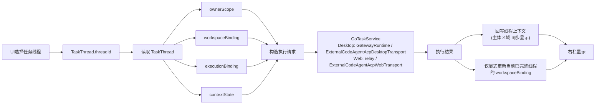

# Assistant TaskThread 信息架构

本文描述当前 XWorkmate 中，线程信息如何围绕 `TaskThread` 进入 UI、进入 controller / runtime 的执行请求构造、再通过 `GoTaskService` 回写到 UI。

本文统一采用 `TaskThread` 聚合对象作为线程信息架构主语义。

## 1. TaskThread 作为线程信息主对象

当前线程信息架构的主语义只有一个：`TaskThread`。

```text
TaskThread
- threadId
- ownerScope
- workspaceBinding
- executionBinding
- contextState
- lifecycleState
```

当前规则：

1. UI 当前选择的是 `TaskThread.threadId`。
2. UI 选中线程后，读取的是完整 `TaskThread`。
3. 主体区域显示、右栏显示、执行请求构造都围绕同一个 `TaskThread`。
4. UI 保持现有结构，但不是线程信息的独立来源。

## 2. 线程信息结构

### 2.1 ownerScope

负责：

- 线程归属
- owner 维度展示
- remote owner path 推导上下文

### 2.2 workspaceBinding

负责：

- `workspaceBinding.workspacePath`：执行工作空间
- `workspaceBinding.displayPath`：右栏路径展示
- `workspaceBinding.workspaceKind`：本地 / 远端工作空间语义

约束：

- `workspaceBinding` 是线程记录的一部分
- 它只能在当前线程已完整时被显式更新
- 它不能用于 create first binding
- 它不能跨线程覆盖
- 它不再承担运行前 fallback 猜测语义

### 2.3 executionBinding

负责：

- 当前线程执行模式
- provider / endpoint 绑定
- 为 `GoTaskService / runtime` 协调层提供调度输入

### 2.4 contextState

负责：

- 消息历史
- 模型选择
- 技能选择与导入
- 权限等级
- message view mode
- 最近一次执行附加上下文

### 2.5 lifecycleState

负责：

- `archived`
- `status`
- `lastRunAtMs`
- `lastResultCode`

它表达的是线程生命周期摘要，不是线程主对象的替代品。

## 3. 信息流转图



这张图表达的是当前线程信息架构，而不是旧的“工作目录 fallback 流程”：

- `读取 TaskThread` 是 UI 与执行层共享的唯一线程信息入口
- `构造执行请求` 在 `GoTaskService / runtime` 协调层完成
- `右栏显示` 明确依赖 `TaskThread` 当前记录
- `workspaceBinding` 更新只允许发生在当前线程已完整的前提下
- prompt 中的 `workspace_root` side-channel 已退出主链；workspace 更新只允许来自 create/load 显式绑定或结构化执行结果回写

## 4. UI 信息来源矩阵

| UI / 信息面 | 主来源字段 | 当前说明 |
| --- | --- | --- |
| 当前线程身份 | `threadId` | UI 按 `threadId` 选中线程，再读取完整 `TaskThread` |
| owner 信息 | `ownerScope` | 线程归属、owner 展示与 remote owner path 推导 |
| 工作空间路径展示 | `workspaceBinding.displayPath` | 右栏当前路径展示 |
| 执行工作空间 | `workspaceBinding.workspacePath` | `GoTaskService / runtime` 构造执行请求时使用 |
| 工作空间类型 | `workspaceBinding.workspaceKind` | 区分 `localFs / remoteFs` |
| 执行模式 | `executionBinding.executionMode` | 映射 `GoTaskService` 调度输入与 transport 选择 |
| provider / endpoint | `executionBinding.providerId / endpointId` | 当前执行通道来源 |
| 消息历史 | `contextState.messages` | 主体区域消息列表 |
| 模型 | `contextState.selectedModelId` | 当前线程模型选择 |
| 技能 | `contextState.importedSkills / selectedSkillKeys` | 当前线程技能上下文 |
| 权限 | `contextState.permissionLevel` | 当前线程权限等级 |
| message view mode | `contextState.messageViewMode` | 当前线程消息视图模式 |
| 最近 runtime 模型 | `contextState.latestResolvedRuntimeModel` | 最近执行附加信息 |
| 归档状态 | `lifecycleState.archived` | 列表可见性 / 激活资格 |
| 生命周期状态 | `lifecycleState.status` | 当前线程生命周期摘要 |
| 最近执行摘要 | `lifecycleState.lastRunAtMs / lastResultCode` | 右栏和列表可消费的最近结果信息 |

## 5. 当前实现边界

当前实现边界如下：

- UI 仍保持现有结构与呈现方式
- UI 不负责执行请求构造
- controller / runtime 负责根据 `TaskThread` 构造请求并调用 `GoTaskService`
- 执行结果先回写线程上下文，主体区域同步显示
- 右栏显示与预览结果来自当前 `TaskThread` 最新记录
- Desktop / Web 共用同一套 session 语义，只保留 local bridge / remote ACP-RPC transport 差异
- 不再定义新的 relay-only 执行协议

归档文档可以继续保留，但它们只提供历史背景，不再参与当前设计口径。
