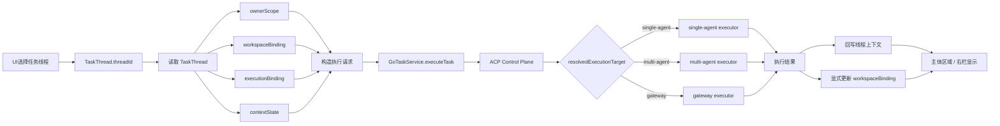

# Assistant TaskThread 信息架构

本文说明线程信息如何围绕 `TaskThread` 进入 UI、进入 controller/runtime 的执行请求构造，再通过统一任务入口回写到 UI。

统一目标规范以
[任务执行链路统一收敛](/Users/shenlan/workspaces/cloud-neutral-toolkit/xworkmate-task-control-plane-unification/docs/architecture/task-control-plane-unification.md)
为准。

## 主规则

1. UI 当前选择的是 `TaskThread.threadId`
2. UI 选中线程后读取完整 `TaskThread`
3. 主体区域显示、右栏显示、执行请求构造都围绕同一个 `TaskThread`
4. UI 保持现有结构，但不是线程信息的独立来源

## 信息流转图

## Current implementation note

- 当前实现中可能仍有 adapter 直连痕迹。
- 这些痕迹不再作为信息架构规范的一部分。

## Target architecture rule

- `读取 TaskThread` 是 UI 与执行层共享的唯一线程信息入口
- `构造执行请求` 在 `GoTaskService / runtime` 协调层完成
- 统一入口是 `GoTaskService.executeTask`
- `gateway` 是 ACP 解析出的执行器分支
- `workspaceBinding` 只允许来自 create/load 显式绑定或结构化结果回写

## Compatibility route (temporary)

- 不再定义新的 relay-only 执行协议
- 旧的 direct gateway / direct collaboration 文档口径已废止
