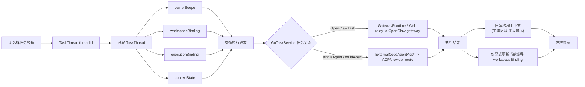

# Assistant TaskThread 当前模型（2026-03-28）

本文以当前设计基准描述 XWorkmate 中 `TaskThread` 的当前模型、主执行链路与字段职责。

本文只说明当前主模型，不再沿用旧线程字段集合与旧工作目录叙事。

## 1. 当前结论

1. `TaskThread` 是任务线程的唯一主对象。
2. UI 保持现有结构不变，但线程选择的唯一键是 `TaskThread.threadId`。
3. UI 选中线程后，系统必须读取完整 `TaskThread`，而不是从页面状态拼装线程信息。
4. `TaskThread` 持久化 schema 保持不变，但 `workspaceBinding` 在 create/load 时必须完整；缺失 binding 的旧记录按非法数据处理并跳过加载。
5. 执行请求由 controller / runtime 根据 `ownerScope / workspaceBinding / executionBinding / contextState` 构造。
6. controller / runtime 统一通过 `GoTaskService` 调度执行，并遵循 `TaskThread` 驱动的任务分流语义：`OpenClaw task` 走 `TaskThread -> GoTaskService -> GatewayRuntime / Web relay -> OpenClaw gateway`；`singleAgent / multiAgent` 等 ACP lane 走 `TaskThread -> GoTaskService -> ExternalCodeAgentAcp* -> ACP/provider route`。
7. 执行结果先回写 `TaskThread.contextState`，主体区域同步显示；UI 与执行始终只读取当前 `TaskThread.workspaceBinding`，不再存在 runtime first-binding 或 fallback 到 `main`。
8. `contextState` 是线程上下文真相源；`lifecycleState` 只表达生命周期摘要；controller 侧缓存不承载线程持久语义。

## 2. TaskThread 结构

```text
TaskThread
- threadId: String
- title: String
- ownerScope: ThreadOwnerScope
- workspaceBinding: WorkspaceBinding
- executionBinding: ExecutionBinding
- contextState: ThreadContextState
- lifecycleState: ThreadLifecycleState
- createdAtMs: double
- updatedAtMs: double?
```

### 2.1 ownerScope

```text
ThreadOwnerScope
- realm: ThreadRealm
- subjectType: ThreadSubjectType
- subjectId: String
- displayName: String
```

职责：

- 定义线程归属
- 提供 owner 维度展示信息
- 为 remote owner path 推导提供上下文

### 2.2 workspaceBinding

```text
WorkspaceBinding
- workspaceId: String
- workspaceKind: WorkspaceKind
- workspacePath: String
- displayPath: String
- writable: bool
```

职责：

- `workspacePath`：线程执行时使用的工作空间路径
- `displayPath`：右栏显示路径
- `workspaceKind`：本地 / 远端工作空间语义
- `writable`：当前工作空间是否允许写入

### 2.3 executionBinding

```text
ExecutionBinding
- executionMode: ThreadExecutionMode
- executorId: String
- providerId: String
- endpointId: String
```

职责：

- 定义线程当前执行模式
- 定义 provider / endpoint 绑定
- 为 `GoTaskService / runtime` 的任务分流与执行通道选择提供调度输入

### 2.4 contextState

```text
ThreadContextState
- messages: List<GatewayChatMessage>
- selectedModelId: String
- selectedSkillKeys: List<String>
- importedSkills: List<AssistantThreadSkillEntry>
- permissionLevel: AssistantPermissionLevel
- messageViewMode: AssistantMessageViewMode
- latestResolvedRuntimeModel: String
- gatewayEntryState: String?
```

职责：

- 保存线程消息历史
- 保存模型、技能、权限、message view mode
- 保存最近一次运行解析得到的 runtime 附加信息

### 2.5 lifecycleState

```text
ThreadLifecycleState
- archived: bool
- status: String
- lastRunAtMs: double?
- lastResultCode: String?
```

职责：

- `archived`：归档标记
- `status`：线程生命周期摘要，例如 `ready / error`
- `lastRunAtMs / lastResultCode`：最近执行摘要

## 3. TaskThread 生命周期主链



这条链路是当前唯一生命周期基准：

1. UI 仍保持现有形态，但只负责选择 `threadId` 与消费回写结果。
2. 线程的执行输入来自完整 `TaskThread`。
3. `构造执行请求` 属于 `GoTaskService / runtime` 协调层，不属于 UI。
4. 当前任务流不是单一路由：`OpenClaw task` 与 ACP lane 在 `TaskThread` 读取之后立即分流。
5. `OpenClaw task` 的规范路径是 `TaskThread -> GoTaskService -> GatewayRuntime / Web relay -> OpenClaw gateway`。
6. `singleAgent / multiAgent` 的规范路径是 `TaskThread -> GoTaskService -> ExternalCodeAgentAcp* -> ACP/provider route`。
7. `回写线程上下文` 是执行结束后的第一落点；主体区域同步显示依赖这一回写。
8. `workspaceBinding` 不是运行时补齐对象；线程在 create/load 时必须已经完整。
9. `右栏显示` 与执行请求都读取当前 `TaskThread.workspaceBinding`，因此它与主体区域共享同一线程事实来源。

## 4. 当前设计约束

### 4.1 UI 约束

- 现有 UI 结构保持不变。
- UI 不是执行请求构造者。
- UI 不是工作空间推断器。
- UI 不是线程状态的独立真相源。

### 4.2 GoTaskService / runtime 协调层约束

- 根据 `ownerScope / workspaceBinding / executionBinding / contextState` 构造执行请求。
- 负责根据任务类型把线程请求分流到正确执行通道，而不是让 Flutter UI 直接承担 runtime 职责。
- `OpenClaw task` 必须走 `TaskThread -> GoTaskService -> GatewayRuntime / Web relay -> OpenClaw gateway`。
- `singleAgent / multiAgent` 必须走 `TaskThread -> GoTaskService -> ExternalCodeAgentAcp* -> ACP/provider route`。
- 接收执行结果并驱动 `TaskThread` 回写。

### 4.3 TaskThread 约束

- `threadId` 是线程身份唯一键。
- `workspaceBinding` 是 `TaskThread` 的必填生命周期字段；create/load 阶段缺失即为非法线程数据。
- `contextState` 是线程上下文真相源。
- `lifecycleState` 只表达归档与生命周期摘要，不替代线程主体模型。

## 5. 与其他文档的边界

- [task-thread-session-key-isolation-20260329.md](task-thread-session-key-isolation-20260329.md)
  补充“任务线必须先成为真实 `TaskThread/sessionKey`”的隔离约束，说明为什么 single-agent 的工作目录只能围绕当前线程身份解析。
- [assistant-thread-information-architecture.md](assistant-thread-information-architecture.md)
  说明线程信息如何进入 UI、`GoTaskService / runtime` 请求构造、结果回写和右栏展示。
- [xworkmate-internal-state-architecture.md](xworkmate-internal-state-architecture.md)
  说明控制器、状态存储和派生 UI 状态如何围绕 `TaskThread` 组织。
- [xworkmate-layered-architecture.md](xworkmate-layered-architecture.md)
  说明 `GoTaskService`、`GatewayRuntime / Web relay`、`ExternalCodeAgentAcp*` 与 `ACP/provider route` 的分层关系。

归档文档仍可保留作为历史背景，但不再参与当前设计说明。
