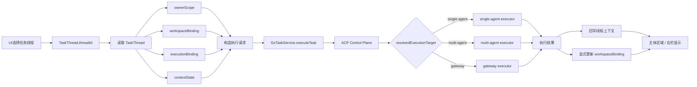

# Assistant TaskThread 当前模型（2026-03-28）

本文保留 `TaskThread` 的当前模型说明，但不再把现有兼容分流描述为长期规范。

统一规范以 [任务执行链路统一收敛](/Users/shenlan/workspaces/cloud-neutral-toolkit/xworkmate-task-control-plane-unification/docs/architecture/task-control-plane-unification.md) 为准。

## 当前结论

1. `TaskThread` 是任务线程的唯一主对象。
2. UI 保持现有结构不变，但线程选择的唯一键是 `TaskThread.threadId`。
3. UI 选中线程后，系统必须读取完整 `TaskThread`。
4. `workspaceBinding` 在 create/load 时必须完整；缺失 binding 的旧记录按非法数据处理并跳过加载。
5. 执行请求由 controller / runtime 根据 `ownerScope / workspaceBinding / executionBinding / contextState` 构造。
6. 当前实现曾存在多条执行链，但目标规范已经收敛到 `UI -> GoTaskService -> ACP -> resolved executor`。
7. 执行结果先回写 `TaskThread.contextState`，主体区域同步显示。
8. `contextState` 是线程上下文真相源；`lifecycleState` 只表达生命周期摘要。

## TaskThread 结构

```text
TaskThread
- threadId: String
- title: String
- ownerScope: ThreadOwnerScope
- workspaceBinding: WorkspaceBinding
- executionBinding: ExecutionBinding
- contextState: ThreadContextState
- lifecycleState: ThreadLifecycleState
- createdAtMs: double
- updatedAtMs: double?
```

## 生命周期主链



## Current implementation note

- 当前仓库仍能看到一些历史分流痕迹。
- 这些实现痕迹不再作为长期规范文档的一部分。

## Target architecture rule

- 目标规范是单一路径：`TaskThread -> GoTaskService -> ACP -> resolved executor`
- `gateway` 是解析后的执行器分支，不是 UI/controller 的规范旁路

## Compatibility route (temporary)

- 历史文档中的 `OpenClaw lane`、`ACP lane` 并列口径已废止
- 若代码中仍出现旧 route，只能视为待清理实现遗留
