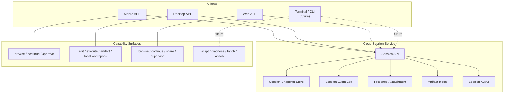
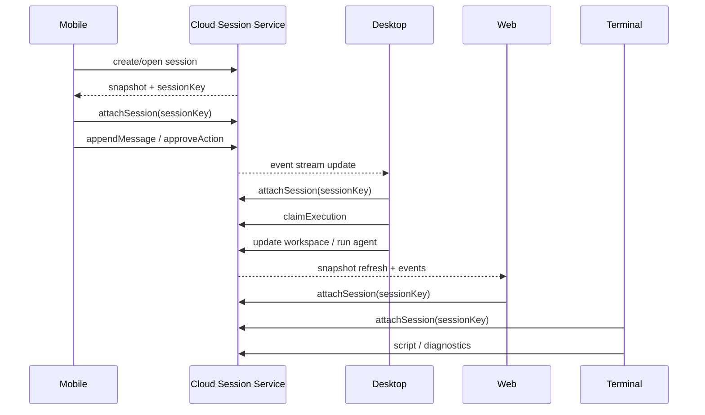

# Cloud Session Service 多端会话架构（2026-03-30）

本文定义 XWorkmate 的目标架构：以 Cloud Session Service 作为会话权威存储，Mobile / Desktop / Web 作为不同的 client + capability surface，在同一个会话上下文上实现无缝切换、继续输入、接管执行和跨端回看。

Terminal 先不作为当前目标的一等端，只保留为未来可扩展方向。

本文是目标架构文档，不替代现有的 `TaskThread` 主模型、session key 隔离约束或 internal state 说明，而是把它们提升到跨设备形态。

## 1. 目标结论

1. Cloud Session Service 是会话真相源。
2. 一个会话对应一个稳定的 `sessionKey` / `threadId`。
3. Mobile / Desktop / Web 都只是同一会话的不同客户端形态。
4. 各端的职责不是复制会话，而是 attach 到同一会话并消费同一份状态。
5. 会话同步采用 `snapshot + event stream` 的混合模型。
6. Desktop 是主要执行端，Web 是轻量接力端，Mobile 是随身控制台。
7. 本地缓存只能做离线兜底，不得替代云端权威状态。

## 2. 现有代码基础

当前仓库里已经存在一组很适合作为目标架构起点的实现：

- [`/Users/shenlan/workspaces/cloud-neutral-toolkit/xworkmate/lib/runtime/runtime_models_runtime_payloads.dart`](file:///Users/shenlan/workspaces/cloud-neutral-toolkit/xworkmate/lib/runtime/runtime_models_runtime_payloads.dart)
  已定义 `TaskThread`、`WorkspaceBinding`、`ExecutionBinding`、`ThreadContextState`、`ThreadLifecycleState` 等核心线程模型。
- [`/Users/shenlan/workspaces/cloud-neutral-toolkit/xworkmate/lib/web/web_session_repository.dart`](file:///Users/shenlan/workspaces/cloud-neutral-toolkit/xworkmate/lib/web/web_session_repository.dart)
  已有浏览器本地缓存和远端会话仓库的抽象雏形。
- [`/Users/shenlan/workspaces/cloud-neutral-toolkit/xworkmate/lib/web/web_store.dart`](file:///Users/shenlan/workspaces/cloud-neutral-toolkit/xworkmate/lib/web/web_store.dart)
  已有 Web 端本地持久化、会话 client id、远端 relay token 的存储能力。
- [`/Users/shenlan/workspaces/cloud-neutral-toolkit/xworkmate/lib/app/app_controller_web_gateway_relay.dart`](file:///Users/shenlan/workspaces/cloud-neutral-toolkit/xworkmate/lib/app/app_controller_web_gateway_relay.dart)
  已有远端 relay 连接、会话刷新、历史同步和模型刷新逻辑。
- [`/Users/shenlan/workspaces/cloud-neutral-toolkit/xworkmate/lib/app/app_controller_desktop_thread_sessions.dart`](file:///Users/shenlan/workspaces/cloud-neutral-toolkit/xworkmate/lib/app/app_controller_desktop_thread_sessions.dart)
  已有桌面端围绕 `sessionKey` / `TaskThread` 的线程上下文读取逻辑。

因此，目标不是重写，而是把“本地控制器 + relay + 线程模型”升级成“跨端会话平台”。

## 3. 目标架构



### 3.1 Cloud Session Service

Cloud Session Service 负责：

- 会话创建、读取、更新、归档
- 会话快照持久化
- 会话事件追加和回放
- 多设备 presence 管理
- 执行权接管与释放
- artifact 索引
- 会话级权限与鉴权

它是唯一的权威状态源，不允许客户端直接把本地缓存当作最终状态。

### 3.2 Client / Capability Surface

客户端不等于完整应用副本，而是同一个会话的不同能力视图：

- Mobile 以“随身继续和审批”为主
- Desktop 以“主执行和深编辑”为主
- Web 以“随时接力和共享查看”为主
- Terminal 先不纳入当前落地范围

能力表述是会话层能力，不是 UI 页面能力。

## 4. 会话模型

建议把现有 `TaskThread` 提升为跨端统一的会话骨架，并补齐多端语义。

```text
TaskThread / SessionRecord
- threadId / sessionKey
- title
- ownerScope
- workspaceBinding
- executionBinding
- contextState
- lifecycleState
- presenceState
- attachmentState
- artifactState
- syncState
```

### 4.1 `sessionKey` / `threadId`

这是会话身份唯一键。

规则：

- 所有客户端必须使用同一个 `sessionKey`
- 不允许空 key 直接进入可执行状态
- 不允许 silent fallback 到 `main` 作为跨端兜底身份

### 4.2 `presenceState`

用于描述当前会话有哪些设备在线。

建议字段：

- `deviceId`
- `clientType`
- `platform`
- `lastSeenAtMs`
- `currentMode`
- `capabilities`
- `isActiveExecutor`

### 4.3 `attachmentState`

用于描述某个客户端是否已经 attach 到该会话。

建议字段：

- `attachedClientId`
- `attachedAtMs`
- `attachmentRole`
- `viewOnly`
- `canExecute`
- `canApprove`

### 4.4 `syncState`

用于描述同步进度。

建议字段：

- `lastSnapshotVersion`
- `lastEventSeq`
- `syncStatus`
- `pendingLocalEdits`

## 5. 同步策略

### 5.1 快照

快照用于：

- 客户端首次进入会话
- 页面刷新后的恢复
- 网络中断后的重连
- 新设备 attach 后的基线对齐

快照应包含：

- 线程主体状态
- 当前 messages
- 当前 executionBinding
- workspaceBinding
- lifecycleState
- artifact 索引摘要
- presence 摘要

### 5.2 事件流

事件流用于：

- 新消息追加
- 状态变更
- artifact 更新
- device attach / detach
- 执行开始 / 结束 / 失败
- 权限变化

事件应具备：

- 单调递增序号
- 幂等消费能力
- 可回放
- 可补洞

### 5.3 客户端合并规则

合并优先级建议如下：

1. 云端事件
2. 云端快照
3. 客户端未提交本地草稿
4. 本地缓存

这意味着本地缓存只能用于提升体验，不能覆盖云端事实。

## 6. 多端角色分工

### 6.1 Mobile APP

Mobile 负责：

- 打开会话
- 浏览最近进展
- 发送短输入
- 审批高风险操作
- 接收任务完成通知
- 跳转到 Desktop 继续深度编辑

Mobile 不负责：

- 本地 workspace 执行
- 长时间 agent 运行
- 重型 artifact 处理

### 6.2 Desktop APP

Desktop 负责：

- 主要执行权
- 本地 workspace
- 代码编辑
- agent 运行
- artifact 预览
- 深度调试

Desktop 是最强能力 surface，也是最自然的“接管执行”客户端。

### 6.3 Web APP

Web 负责：

- 轻量接力
- 浏览会话历史
- 跨设备继续输入
- 远程监督和分享
- 无需本地安装的快速接入

Web 最适合作为跨设备的默认入口。

### 6.4 Terminal / CLI

Terminal 先不纳入当前落地范围。

未来如果要接入，它应当复用同一套 session attach / event stream / presence 协议，而不是单独发明会话体系。

## 7. 与当前仓库的对应改造

### 7.1 `TaskThread` 仍是主模型

当前仓库里的 `TaskThread` 已经足够承担“跨端会话骨架”，后续可以继续沿用：

- `workspaceBinding`
- `executionBinding`
- `contextState`
- `lifecycleState`

需要补充的不是“另一个 thread 模型”，而是：

- `presenceState`
- `attachmentState`
- `syncState`

### 7.2 `WebSessionRepository` 升级方向

当前 [`/Users/shenlan/workspaces/cloud-neutral-toolkit/xworkmate/lib/web/web_session_repository.dart`](file:///Users/shenlan/workspaces/cloud-neutral-toolkit/xworkmate/lib/web/web_session_repository.dart) 已经有 `BrowserWebSessionRepository` 和 `RemoteWebSessionRepository`。

建议后续演进为：

- `SessionRepository`
- `SessionSyncClient`
- `SessionEventStreamClient`

其中：

- `Repository` 负责快照读写
- `SyncClient` 负责事件提交
- `EventStreamClient` 负责实时订阅

### 7.3 `WebStore` 的边界

当前 [`/Users/shenlan/workspaces/cloud-neutral-toolkit/xworkmate/lib/web/web_store.dart`](file:///Users/shenlan/workspaces/cloud-neutral-toolkit/xworkmate/lib/web/web_store.dart) 适合作为：

- client id 存储
- 本地草稿缓存
- 离线恢复缓存

但它不应该成为会话真相源。

### 7.4 Desktop / Web 控制器边界

当前桌面和 Web 的 controller 主要负责：

- 读取当前 session
- 渲染 thread / workspace / skills / model
- 触发 relay 或 runtime 行为

在目标架构里，它们应当只做“会话附着后的客户端编排”，不再自建平行状态真相。

## 8. 推荐接口形态

### 8.1 Session API

建议 API 形态如下：

```text
GET    /v1/sessions
POST   /v1/sessions
GET    /v1/sessions/:sessionKey
PUT    /v1/sessions/:sessionKey
POST   /v1/sessions/:sessionKey/attach
POST   /v1/sessions/:sessionKey/detach
POST   /v1/sessions/:sessionKey/events
GET    /v1/sessions/:sessionKey/events?after=...
GET    /v1/sessions/:sessionKey/presence
GET    /v1/sessions/:sessionKey/artifacts
```

### 8.2 客户端动作

客户端应支持的最小动作集：

- `createSession`
- `openSession`
- `attachSession`
- `detachSession`
- `appendMessage`
- `updateWorkspace`
- `claimExecution`
- `releaseExecution`
- `subscribeSession`

## 9. 切换流程



切换的本质是：

- 不是复制会话
- 不是导出导入
- 不是重新开始
- 而是多个端围绕同一会话共同工作

## 10. 风险与约束

### 10.1 并发写入

如果多个端同时写同一会话，必须有：

- 乐观版本号
- event seq
- 冲突检测
- 冲突解决策略

### 10.2 执行权

建议同一时间只允许一个端持有 active executor。

其他端可以：

- 继续输入草稿
- 浏览状态
- 发起审批
- 请求接管

但不能无条件并发执行。

### 10.3 安全

会话身份、设备身份、访问 token、执行权都应分离管理。

要求：

- 令牌不进日志
- 设备身份可追踪
- attachment 必须授权
- remote mode 不能 silent downgrade

### 10.4 离线

离线时客户端可以：

- 缓存草稿
- 缓存最近快照
- 记录待提交事件

回网后必须：

- 重新拉快照
- 重新对齐 event seq
- 再恢复 attach 状态

## 11. 推荐实施顺序

1. 统一会话术语
   - `sessionKey = threadId`
   - `TaskThread` 作为主骨架
   - 补充 presence / attachment / sync 语义
2. 抽象 Cloud Session Service 协议
   - 快照
   - 事件
   - attach/detach
3. 先让 Web 接入云会话
   - 最快验证多端接力
4. 再让 Desktop 变成主执行端
   - 接管执行权
   - 同步 artifact 和 workspace
5. 最后接入 Mobile，Terminal 作为未来扩展方向
   - 轻交互
   - 脚本化操作

## 12. 与现有文档的关系

- [`/Users/shenlan/workspaces/cloud-neutral-toolkit/xworkmate/docs/architecture/task-control-plane-unification.md`](/Users/shenlan/workspaces/cloud-neutral-toolkit/xworkmate/docs/architecture/task-control-plane-unification.md)
  说明当前 `TaskThread` 主模型。
- [`/Users/shenlan/workspaces/cloud-neutral-toolkit/xworkmate/docs/architecture/task-thread-session-key-isolation-20260329.md`](file:///Users/shenlan/workspaces/cloud-neutral-toolkit/xworkmate/docs/architecture/task-thread-session-key-isolation-20260329.md)
  说明 `sessionKey` 与线程身份隔离约束。
- [`/Users/shenlan/workspaces/cloud-neutral-toolkit/xworkmate/docs/architecture/xworkmate-layered-architecture.md`](/Users/shenlan/workspaces/cloud-neutral-toolkit/xworkmate/docs/architecture/xworkmate-layered-architecture.md)
  说明当前内部状态如何围绕 `TaskThread` 组织。

本文在这些基础上进一步上升一层，定义跨设备会话的目标架构。
