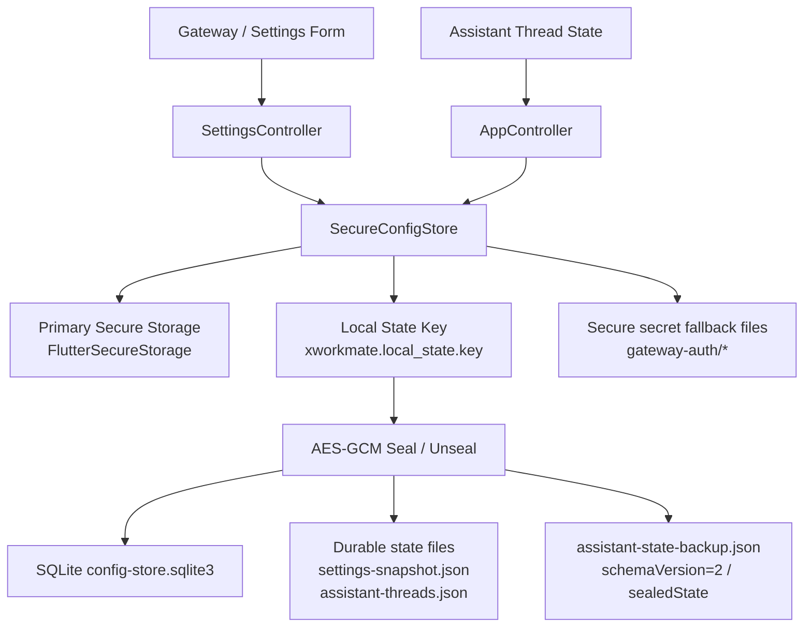

# Secure Local Persistence Architecture

## 目标

这次补丁保持现有 UI 不变，只重设计 `XWorkmate` 的本地配置与任务会话持久层，满足两个约束：

- 本地配置和任务会话必须能跨重启、跨覆盖安装恢复。
- 持久化以前提 `secure storage` 为本地信任根，避免把可恢复状态明文落盘。

## 当前实现基线（v0.6.1）

### 1) macOS 标准持久化目录

默认目录按 Apple 常规结构落在：

- `~/Library/Application Support/plus.svc.xworkmate/xworkmate`

关键文件与目录：

- `config-store.sqlite3`（`SettingsStore` 主库）
- `settings-snapshot.json`（durable mirror）
- `assistant-threads.json`（durable mirror）
- `gateway-auth/secure-storage/*`（`SecretStore` 文件型安全存储 fallback）

### 2) 首次安装初始化

- `SettingsStore.initialize()` 会初始化并打开 `config-store.sqlite3`。
- `SecretStore.initialize()` 会初始化 `gateway-auth` 与 `secure-storage` 目录结构。
- 因此 DMG 首次安装后，重启前无需手工“触发一次保存”即可完成持久化目录与主存储文件的准备。

### 3) 升级与重启行为

- 应用升级 / 系统更新重启不会改写或重置既有路径。
- 只在用户主动执行“设置 -> 诊断 -> 清理任务线程与本地配置”时清理本地 settings/thread 状态。
- 清理流程不删除已保存 secrets（Gateway token/password、AI Gateway API key、Vault token 等）。

### 4) 路径解析失败策略（默认）

- 默认策略为 `fail-fast`：当 `SettingsStore` 无法解析或打开耐久数据库路径时，直接抛错，不再静默降级为内存持久化。
- 这样可以避免“看起来保存成功、重启后全部丢失”的隐性故障。

### 5) 内存回退（仅显式开启场景）

- 仅在显式开启 `allowInMemoryFallback`（主要用于测试/诊断）时允许内存回退。
- 即使发生内存回退，也会在后续写入和销毁阶段尽力回写同步到耐久目录（若路径恢复可用）。

核心结论：

- `FlutterSecureStorage` 仍是长期 secret 的主存储。
- 本地配置和任务会话不直接明文写入 SQLite / JSON，而是先用本地状态密钥加密后再落盘。
- 本地状态密钥本身必须优先保存在主 secure storage，不再把它当成普通可降级 secret。

## Trust Boundary

需要明确区分 3 类状态：

1. 用户输入的高敏感 secret
   - Gateway shared token
   - Gateway password
   - AI Gateway API key
   - Vault token

2. 可恢复但不应明文落盘的本地状态
   - `SettingsSnapshot`
   - Assistant 任务线程记录
   - 最后活动线程
   - 本地恢复 backup

3. 仅调试或测试环境可接受的替代路径
   - 注入式 secure storage client
   - 临时文件型 secure storage fallback

边界规则：

- 第 1 类状态优先进入 secure storage；secure storage 超时或异常时，可进入持久化 fallback 文件，但绝不退化成“仅内存”。
- 第 2 类状态不直接进入 `SharedPreferences` 或明文 SQLite；必须先 sealed。
- 第 3 类路径只用于 debug / test，不进入 release 行为。

## 架构图

## 存储分层

### 1. Primary Secure Storage

用途：

- 保存 Gateway token / password / AI Gateway API key / Vault token
- 保存本地状态密钥 `xworkmate.local_state.key`

关键要求：

- 主路径仍然是 `FlutterSecureStorage`
- 本地状态密钥不允许再走“通用 secret fallback”
- 如果主 secure storage 不可用，不允许把本地状态密钥退化成普通文件常态

### 2. Sealed Local State

本地配置和任务会话的持久化结构统一改为：

- `storageFormat = xworkmate.sealed.local-state.v1`
- `nonce`
- `cipherText`
- `mac`

加密方式：

- AES-GCM 256
- 每次写入使用新的随机 nonce
- AAD 绑定存储 key，避免跨 key 错读

当前覆盖对象：

- `xworkmate.settings.snapshot`
- `xworkmate.assistant.threads`
- `assistant-state-backup.json`

### 3. Durable Recovery Files

当 SQLite 不可用时，仍需保证本地状态可以恢复。为此保留两类耐久化文件：

- `settings-snapshot.json`
- `assistant-threads.json`

注意：

- 文件名虽然保持旧风格，但内容已改为 sealed payload，不再是明文 JSON。

### 4. Assistant Backup

`assistant-state-backup.json` 升级到 schema v2：

- 用 `sealedState` 保存整体恢复快照
- 不再把 settings / threads 明文拼进 backup

这样做的目的：

- 避免备份文件成为最容易泄露的明文副本
- 保持“数据库损坏时仍可恢复”的能力

## 写入流程

### SettingsSnapshot

1. `SettingsController` 生成新的 `SettingsSnapshot`
2. `SecureConfigStore.saveSettingsSnapshot()` 进入本地状态写队列
3. 读取或生成 `xworkmate.local_state.key`
4. 先 sealed，再写入 SQLite / durable file / backup

### Assistant Threads

1. `AppController` 更新线程记录
2. 持久化进入 `_assistantThreadPersistQueue`
3. `SecureConfigStore.saveAssistantThreadRecords()` 串行 sealed 写入
4. 同步刷新 SQLite / durable file / backup

这么做是为了避免异步写晚到，把旧线程快照覆盖新状态。

## 读取与恢复流程

恢复顺序：

1. 优先读 SQLite
2. SQLite 不可用时读 durable state files
3. 若主状态缺失，再读 `assistant-state-backup.json`
4. 若读到的是旧明文格式，则立即迁移为 sealed 格式

迁移原则：

- 兼容旧明文快照，避免升级后直接丢历史
- 一旦成功恢复，就把旧格式重写成 sealed 新格式
- legacy `SharedPreferences` 里的本地状态在迁移后会被清理

## Secure Secret Fallback

Secret fallback 仍然保留，但语义变了：

- 用于 Gateway token / password / API key 等长期 secret 的持久化兜底
- 不再因为一次超时就退化成“仅内存”
- 这样即使 secure storage 一时不可用，重启后 secret 仍能恢复

约束：

- `xworkmate.local_state.key` 不在通用 fallback 白名单里
- 对旧版遗留的 `local-state-key.txt`，启动时做一次迁移，成功后删除

## Clear 行为

`clearAssistantLocalState()` 只清理：

- 本地 settings snapshot
- 本地 assistant thread records
- durable state files
- assistant backup

不会误删：

- 已保存的 Gateway token / password
- AI Gateway API key
- Vault token
- 其他 secure refs

## Debug / Test 策略

为了让测试稳定运行，新增了可注入的 secure storage 层：

- `SecureStorageClient`
- `FlutterSecureStorageClient`
- `FileSecureStorageClient`
- `MemorySecureStorageClient`

策略是：

- release：使用真实 `FlutterSecureStorage`
- debug / test：允许走注入式或文件型 secure storage，保证单测和回归可跑

这不会改变 release 的安全边界。

## 与现有 UI 的关系

这次补丁不改：

- Gateway 设置页结构
- Assistant 任务线程 UI
- 模型、skills、入口按钮布局

变化只在持久层和恢复链路：

- 重启后不再因为 secure storage 一次超时而丢本地配置
- 覆盖安装后本地配置与任务会话仍可恢复
- 本地 snapshot / backup 不再以明文保存
