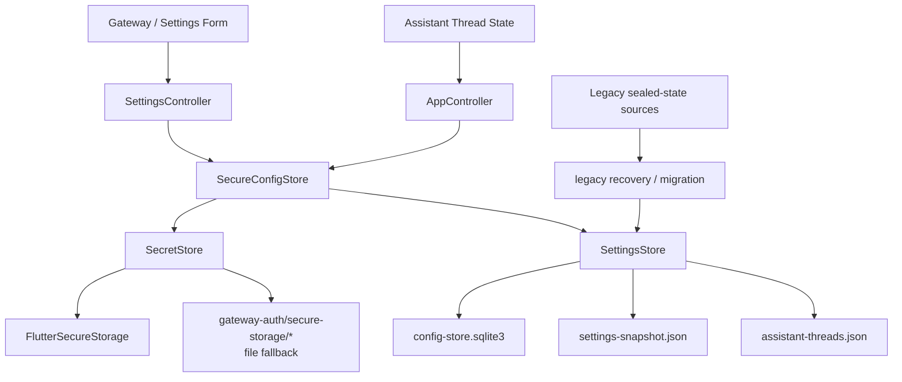

# Secure Local Persistence Architecture

## 目标

本文记录 `XWorkmate.svc.plus` 当前桌面端本地持久化实现的真实基线，并明确区分：

- 当前正在使用的持久化路径
- 仅用于旧版本恢复的 legacy sealed-state 路径
- secret 与 recoverable local state 的边界

如果后续重新引入 sealed local state，这份文档必须和 `SettingsStore` 写路径、测试断言一起更新。

## 当前实现基线（v0.6.1）

### 1) macOS 标准持久化目录

默认目录按 Apple 常规结构落在：

- `~/Library/Application Support/plus.svc.xworkmate/xworkmate`

当前活跃文件与目录：

- `config-store.sqlite3`
  - `SettingsStore` 主库
- `settings-snapshot.json`
  - `SettingsSnapshot` 的 durable mirror
- `assistant-threads.json`
  - `AssistantThreadRecord` 列表的 durable mirror
- `gateway-auth/secure-storage/*`
  - `SecretStore` 的文件型 secure-storage fallback

### 2) 首次安装初始化

- `SettingsStore.initialize()` 会初始化并打开 `config-store.sqlite3`
- `SecretStore.initialize()` 会初始化 `gateway-auth` 与 `secure-storage` 目录结构
- 因此首次安装后，不需要等用户手工保存一次，目录与主存储文件就会被准备好

### 3) 升级与重启行为

- 应用升级 / 系统更新重启不会改写既有持久化目录
- 用户主动执行“设置 -> 诊断 -> 清理任务线程与本地配置”时，清理的是本地 settings / thread 状态
- 清理流程不会删除已保存 secrets（Gateway token / password、AI Gateway API key、Vault token、device token 等）

### 4) 路径解析失败策略（默认）

- 默认策略仍然是 `fail-fast`
- 当 `SettingsStore` 无法解析或打开耐久数据库路径时，直接抛错
- 只有显式开启 `allowInMemoryFallback` 时才允许内存数据库回退

### 5) 当前最重要的实现结论

- 长期 secret 继续通过 `SecretStore` 持久化，主路径是 `FlutterSecureStorage`
- `SettingsSnapshot` 与 `AssistantThreadRecord` 当前写入的是明文 JSON 字符串
  - 会写入 `config-store.sqlite3`
  - 也会写入 `settings-snapshot.json` / `assistant-threads.json`
- `assistant-state-backup.json`、`sealedState`、`xworkmate.local_state.key` 现在不是当前主写路径
  - 它们只保留在旧版本恢复 / 迁移兼容逻辑里

## Trust Boundary

当前需要区分 3 类状态：

### 1. 高敏感 secret

- Gateway shared token
- Gateway password
- AI Gateway API key
- Vault token
- device token / device identity 私钥材料

### 2. 可恢复的本地应用状态

- `SettingsSnapshot`
- `AssistantThreadRecord` 列表
- assistant custom task titles
- archived task keys
- last session key
- 本地审计 trail

### 3. Legacy sealed-state 恢复输入

- 旧版 `assistant-state-backup.json`
- 旧版 `xworkmate.sealed.local-state.v1` payload
- `local-state-key.txt`
- secure storage 里的 `xworkmate.local_state.key`

边界规则：

- 第 1 类状态走 `SecretStore`
- 第 2 类状态当前走 `SettingsStore`，属于 recoverable app state，不是 secret store
- 第 3 类状态只用于 recovery / migration，不是当前版本的常规写入目标

## 当前架构图

说明：

- 当前活跃写路径是 `SecretStore` + `SettingsStore`
- legacy sealed-state 只参与读旧数据并迁移到当前 store，不参与当前常规写入

## 存储分层

### 1. 当前 secret 存储

用途：

- 保存 Gateway token / password
- 保存 AI Gateway API key
- 保存 Vault token
- 保存 device identity / device token

实现要点：

- 主路径是 `FlutterSecureStorage`
- 当 secure storage 不可用时，`SecretStore` 会尝试提升到文件型 fallback
- 文件型 fallback 位于 `gateway-auth/secure-storage/*`

### 2. 当前本地状态持久化

当前覆盖对象：

- `xworkmate.settings.snapshot`
- `xworkmate.assistant.threads`
- `xworkmate.secrets.audit`

实现要点：

- `SettingsSnapshot` 通过 `toJsonString()` 写入
- `AssistantThreadRecord` 列表通过 `jsonEncode(...)` 写入
- 当前写路径没有 AES-GCM seal / unseal
- durable mirror 文件内容当前也是明文 JSON，不是 sealed envelope

### 3. Durable mirror files

当前保留两类 durable mirror：

- `settings-snapshot.json`
- `assistant-threads.json`

语义：

- 作为 SQLite 的文件镜像 / fallback 来源
- 也是测试里会直接读取和断言的当前持久化内容

### 4. Legacy sealed-state recovery path

旧版 sealed local state 兼容仍然保留，但仅用于 recovery：

- 识别旧版 `xworkmate.sealed.local-state.v1`
- 读取旧版 `assistant-state-backup.json` 里的 `sealedState`
- 通过 legacy local state key 解密旧 payload
- 成功恢复后重写到当前 `SettingsStore`

这条路径的目标是兼容旧数据，不代表当前版本仍在主动写 sealed local state。

## 当前写入流程

### SettingsSnapshot

1. `SettingsController` 或 `AppController` 生成新的 `SettingsSnapshot`
2. `SecureConfigStore.saveSettingsSnapshot()`
3. `SettingsStore.saveSettingsSnapshot()`
4. `snapshot.toJsonString()`
5. 写入 SQLite
6. 同步写入 `settings-snapshot.json`

### Assistant Threads

1. `AppController` 更新线程记录
2. 更新被串行排入 `_assistantThreadPersistQueue`
3. `SecureConfigStore.saveAssistantThreadRecords()`
4. `jsonEncode(records.map(...))`
5. 写入 SQLite
6. 同步写入 `assistant-threads.json`

这么做的目标是避免异步写晚到覆盖较新的线程快照；当前目标不是加密封装。

## 当前读取与恢复流程

恢复顺序：

1. 初始化 SQLite
2. 优先读取 SQLite entry
3. SQLite 读不到时，再读 durable mirror 文件
4. 如果当前 state 不可读，再尝试 legacy recovery
5. 若发现旧 sealed-state 但缺少 key，则产生 locked recovery report

补充说明：

- `SharedPreferences` 只作为旧数据迁移兼容来源，不是当前桌面端的主状态真值源
- Web 端有独立的 `WebStore`，不适用这里的桌面持久化链路

## Legacy backup / sealedState 的当前语义

当前代码里：

- `assistant-state-backup.json` 只在 legacy recovery 时读取
- `sealedState` 只在旧版 backup 或旧版 durable value 解密时出现
- `xworkmate.local_state.key` 只通过 legacy loader 参与旧数据恢复

因此这三者现在应该被理解为：

- 兼容旧版本
- 避免升级后直接丢历史
- 不属于当前日常写入架构

## Clear 行为

`clearAssistantLocalState()` 当前会清理：

- `SettingsSnapshot`
- `AssistantThreadRecord` 列表
- `settings-snapshot.json`
- `assistant-threads.json`
- 旧版 `assistant-state-backup.json`（如果存在）

不会误删：

- Gateway token / password
- AI Gateway API key
- Vault token
- device token / device identity

## Debug / Test 策略

为了让测试稳定运行，当前保留可注入的 secure storage client：

- `SecureStorageClient`
- `FlutterSecureStorageClient`
- `FileSecureStorageClient`
- `MemorySecureStorageClient`

策略：

- release：优先真实 `FlutterSecureStorage`
- debug / test：允许注入式或文件型 secure storage
- `allowInMemoryFallback` 只在显式场景下允许内存数据库回退

## 当前文档结论

当前桌面端本地持久化不是 sealed local state 架构，而是：

- secrets 走 secure storage / file fallback
- recoverable local app state 走 SQLite + plain JSON durable mirrors
- legacy sealed-state 只用于恢复旧数据

如果后续要把本地状态重新升级为 sealed payload，必须同步更新：

- `SettingsStore` 写路径
- 文档中的架构图与存储分层
- 相关测试断言
