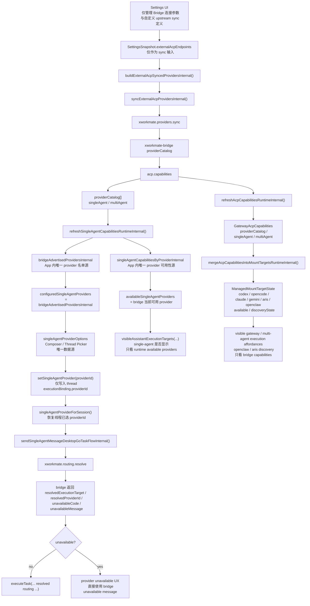

# Settings Integration Configuration Model

This document records the current logical model behind Settings -> Integrations,
with the provider catalog aligned to the bridge-only design.

## Current Rule

- Settings only manages bridge connection parameters and upstream sync
  definitions.
- The provider picker is not derived from local endpoint presets.
- `xworkmate-bridge` is the only source of truth for the provider catalog.

## Bridge-Only Provider Source Of Truth

## Notes

- `externalAcpEndpoints` still matters, but only as bridge sync input.
- Provider visibility and picker contents come from
  `acp.capabilities.providerCatalog`.
- Auto-provider resolution and unavailable messaging come from
  `xworkmate.routing.resolve`.
- `openclaw` and other mount-target discovery states are also bridge-owned and
  come from ACP capabilities merged into `ManagedMountTargetState`.
- Persisted thread `providerId` restores the user's previous selection, but it
  does not repopulate the provider catalog.
