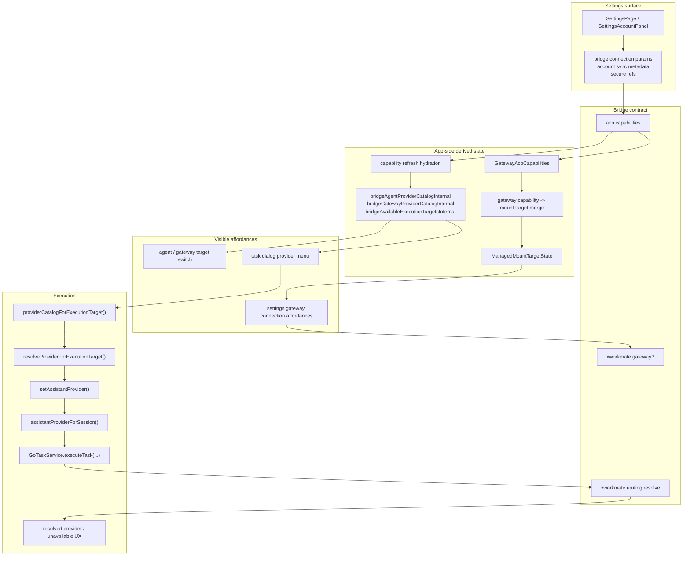
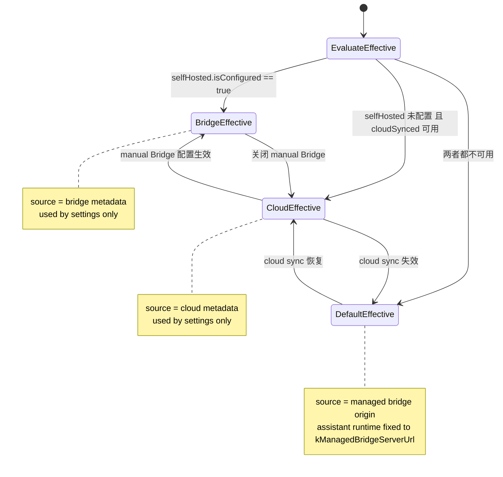

# Settings Integration Configuration Model

Last Updated: 2026-04-19

本文件记录当前 `Settings -> Integrations` 在主链中的职责边界，以及
`acpBridgeServerModeConfig` 在 settings surface 中的配置仲裁规则。

## Current Rule

- Settings 只管理 Bridge 连接参数、account sync 元数据和本地编辑态
- `AcpBridgeServerModeConfig.effective` 只用于 settings surface 的连接与展示语义
- `selfHosted` 优先级高于 `cloudSynced`
- `cloudSynced` 只在 manual Bridge 未配置时作为 settings metadata 回退来源
- app 不从本地 endpoint preset、旧 module 配置、历史 fallback 恢复 provider catalog
- `xworkmate-bridge` 仍然是 provider catalog、gateway capability、routing resolve 的唯一真源
- `BRIDGE_SERVER_URL` 只属于 `AccountSyncState` 元数据，不参与 assistant runtime endpoint 选择
- `BRIDGE_AUTH_TOKEN` 只进入 secure storage / managed secret

## Canonical State Model

For the detailed state diagram and ownership rules, see:

- [Account Sync, Settings, and Bridge State Model](/Users/shenlan/workspaces/cloud-neutral-toolkit/xworkmate-app/docs/architecture/account-sync-settings-bridge-state-model.md)

## Bridge-Owned Source Of Truth

## What Settings Owns

- bridge host / transport / auth input
- account-linked bridge configuration metadata
- `acpBridgeServerModeConfig.cloudSynced`
- `acpBridgeServerModeConfig.selfHosted`
- `acpBridgeServerModeConfig.effective`
- secure secret references
- gateway connection test / connect / disconnect affordance

## What Settings Does Not Own

- 独立 provider catalog
- 独立 module matrix
- app-side gateway preset backfill
- 旧 `ai_gateway` / `secrets` / `account` 页面壳

## Notes

- `AcpBridgeServerModeConfig` 的实际仲裁顺序是 `selfHosted -> cloudSynced -> default`
- `selfHosted.isConfigured == true` 时，`effective.source == 'bridge'`
- `selfHosted` 未配置且 `accountSyncState` 提供了可用云端桥接信息时，`effective.source == 'cloud'`
- 两者都不可用时，`effective.source == 'default'`
- 当前任务对话框 provider 选择主链固定为 `providerCatalogForExecutionTarget() -> resolveProviderForExecutionTarget() -> setAssistantProvider()`
- `agent` catalog 只对应 bridge 广告的 ACP server bridges
- `gateway` catalog 只对应 bridge 返回的 gateway provider 列表；当前为 `openclaw`，未来可扩展 `hermes` 等项
- provider picker 的真源只来自 bridge 返回的 target-scoped catalog；不会因为线程里保存过 `providerId` 就被 app 反向重建
- gateway runtime 可见性来自 bridge capability snapshot 与 `xworkmate.gateway.*` 返回，不来自旧设置页枚举
- bridge 若返回额外 capability flag，这些 flag 只属于合同元数据，不会自动生成新的 settings tab 或 module page
- bridge 若未返回 catalog，provider 菜单为空或禁用；app 不伪造 `codex / opencode / gemini / openclaw`
- production provider / gateway 选择继续由 bridge 拥有，app 只保留消费与展示

## Effective Config Mermaid

## See Also

- [Task Dialog Provider Selection Mainline](/Users/shenlan/workspaces/cloud-neutral-toolkit/xworkmate-app/docs/architecture/task-dialog-provider-selection-mainline.md)
