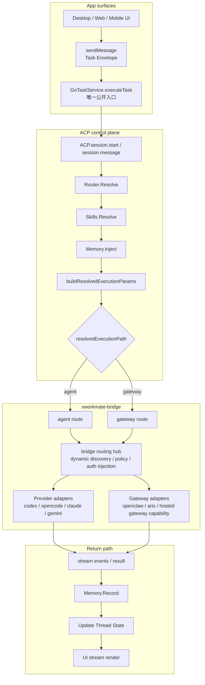

# 任务执行链路统一收敛

Last Updated: 2026-04-11

## 背景

当前仓库里已经存在 `GoTaskService`、Go ACP `Router.Resolve`、`Skills.Resolve`、
`Memory` 与 `buildResolvedExecutionParams`，说明统一控制面已经具备核心骨架。

但旧设计文档长期把不同实现通道写成并列主链，导致：

- Desktop / Web / Mobile 的现状与目标混在一起
- controller 层的历史分流被误认为长期规范
- `local / remote / multi-agent` 被描述成 app 侧一级执行路径

本文件把官方口径统一为：

- UI 不变
- `GoTaskService.executeTask` 是唯一公开入口
- ACP 是统一控制面
- `bridge` 是 app 客户端的发现 / 配置 / 连接 / 对话枢纽
- app 当前只保留 `agent / gateway` 两条路径
- ACP Server list / gateway upstream 由 `xworkmate-bridge` 动态发现与维护
- `$INTERNAL_SERVICE_TOKEN` 仅属于 bridge / internal service 注入责任
- 账户同步只同步 bridge 相关配置属性与安全引用，不做自动连接


## 目标态


## Provider 真源

Single-agent provider catalog and availability are owned by
`xworkmate-bridge`, not by local endpoint presets inside the app.

ACP server addresses and gateway upstreams are also bridge-owned dynamic
discovery data. The app must not treat concrete endpoints such as
`https://acp-server.svc.plus/*` or `wss://openclaw.svc.plus` as app-side
hardcoded truth sources.

```mermaid
flowchart TD
  subgraph INPUT["Config / discovery input"]
    A["Settings UI<br/>仅管理 bridge 连接参数<br/>与账号同步元数据"]
    B["acp.capabilities"]
    C["bridge capability snapshot<br/>providerCatalog / agent / gateway<br/>dynamic upstream discovery"]
    A --> B --> C
  end

  subgraph APPSTATE["App-side truth sources"]
    D["refreshSingleAgentCapabilitiesRuntimeInternal()"]
    E["bridgeProviderCatalogInternal<br/>App 内唯一 provider 名单源"]
    F["singleAgentCapabilitiesByProviderInternal<br/>App 内唯一 provider 可用性源"]
    G["refreshAcpCapabilitiesRuntimeInternal()"]
    H["GatewayAcpCapabilities"]
    I["mergeAcpCapabilitiesIntoMountTargetsRuntimeInternal()"]
    J["ManagedMountTargetState<br/>gateway capability / discovery state"]
    C --> D --> E
    D --> F
    C --> G --> H --> I --> J
  end

  subgraph UISTATE["UI affordances"]
    K["bridgeProviderCatalog<br/>Composer / Thread Picker provider source"]
    L["availableSingleAgentProviders<br/>agent path visibility"]
    M["visible gateway affordances<br/>只看 bridge capabilities / discovery"]
    E --> K
    F --> L
    J --> M
  end

  subgraph EXEC["Execution resolution"]
    N["setSingleAgentProvider(providerId)<br/>仅写入 thread executionBinding.providerId"]
    O["singleAgentProviderForSession()"]
    P["buildExternalAcpRoutingForSessionInternal()"]
    Q["xworkmate.routing.resolve"]
    R["resolvedProviderId / unavailableMessage"]
    S{"unavailable?"}
    T["executeTask(... resolved routing ...)"]
    U["provider unavailable UX<br/>直接使用 bridge unavailable message"]
    K --> N --> O --> P --> Q --> R --> S
    S -->|"no"| T
    S -->|"yes"| U
```

## 端侧桥接规则

### Desktop App

- Desktop App 直接桥接 Go 代码
- Desktop 正常执行链路不以“先启动一个本地 HTTP server，再由 Desktop 自己回连”作为目标架构
- Desktop 的 `sendMessage -> GoTaskService.executeTask -> ACP` 应理解为进程内或直接桥接语义
- Production cloud mode does not call `xworkmate.providers.sync`
- Production provider upstreams are bridge-owned, not app-owned
- Production ACP server list / gateway upstreams are bridge-owned, not app-owned
- `$INTERNAL_SERVICE_TOKEN` 只允许在 bridge / internal service 层使用，app 不持有
- 对 app 来说，bridge 是 discovery / config / connect / dialogue 的统一枢纽

### Web / Mobile

- Web / Mobile UI 连接的是 Go 代码启动出来的 server
- Web / Mobile 通过标准 ACP contract 与该 server 通信
- 对 Web / Mobile 来说，`/acp` 与 `/acp/rpc` 是稳定的网络协议入口

## 协议约束

### 传输协议

- app 侧当前不再把 `local / remote` 作为执行路径语义
- Desktop 只区分 `agent / gateway` 两条路径，二者都经由 `xworkmate-bridge` 路由
- 如果 bridge endpoint 是网络地址，则必须遵守 TLS 要求
- loopback / non-TLS 只允许作为底层 adapter / 开发态传输细节，不能重新上升为产品执行路径语义
- app 不直接持有 ACP server upstream 或 gateway upstream 的授权头
- `Authorization: Bearer $INTERNAL_SERVICE_TOKEN` 属于 bridge / internal service 注入责任

### ACP contract

- websocket endpoint 规范路径：`/acp`
- RPC endpoint 规范路径：`/acp/rpc`
- base URL 派生时必须避免重复拼接 `/acp`
- 以上 endpoint contract 主要适用于 Web / Mobile 与外部 ACP server 的通信语义
- Desktop 目标态不要求为自身 UI 再额外启动一层本地 HTTP ACP server

## 收敛原则

### Current implementation note

- 当前实现可能仍残留历史分流代码
- 这些实现痕迹不再代表规范

### Target architecture rule

- 所有正常发送请求都先进入 `GoTaskService.executeTask`
- 所有任务都先进入 ACP 控制面，再解析到 executor
- Desktop 采用直接桥接 Go 代码的控制面接入方式
- Web / Mobile 采用连接 Go server 的控制面接入方式
- app 侧一级执行路径只保留 `agent / gateway`
- `multi-agent` 是 bridge / gateway 内部能力，不再作为 app 侧一级路径
- app 不直接调用 `acp-server.svc.plus/*` 或 `openclaw.svc.plus`
- 如果需要补全或变更 ACP / gateway upstream，优先在 `xworkmate-bridge` 仓库实现动态发现能力

### Compatibility route (removed from target)

- `openClawTask` 不再属于目标架构
- `GatewayRuntime`、`Web relay`、`GatewayAcpClient` 只作为 adapter/executor 能力存在

## 分阶段方向

1. 文档口径收敛
2. Dart 请求模型统一
3. route 决策内收到 `GoTaskService` / ACP
4. app 侧 bridge 枢纽与 provider / gateway 适配关系收敛
5. `multi-agent` 下沉为 bridge 内部能力，而不是 app 一级路径
