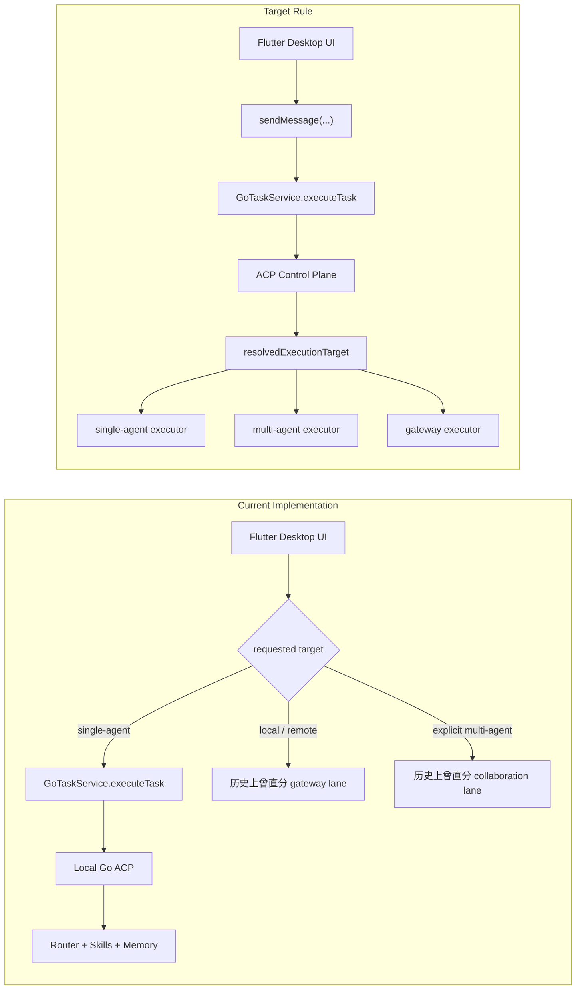
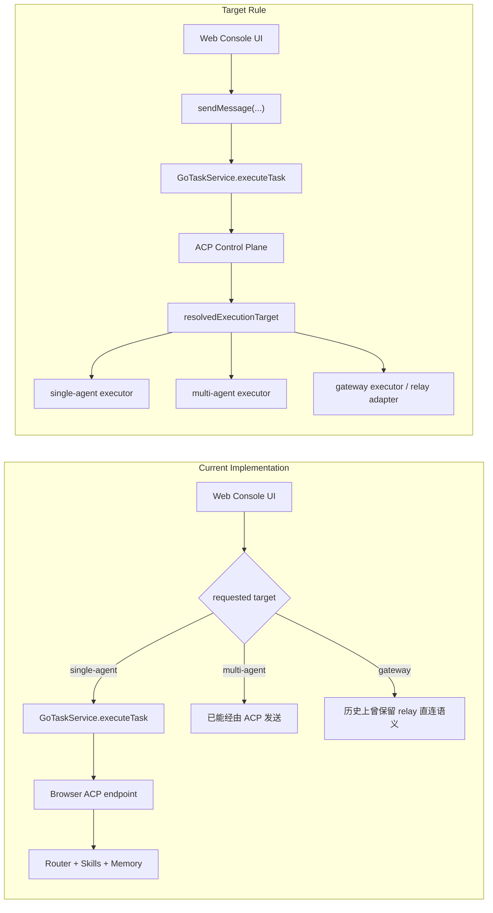
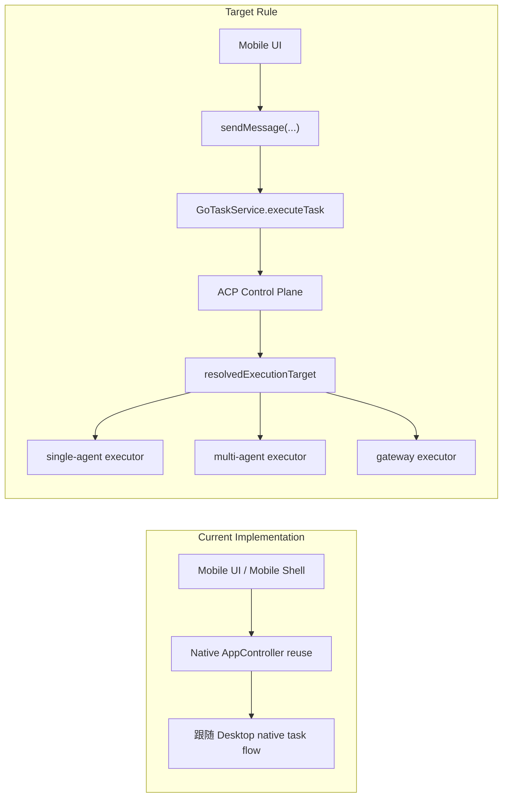
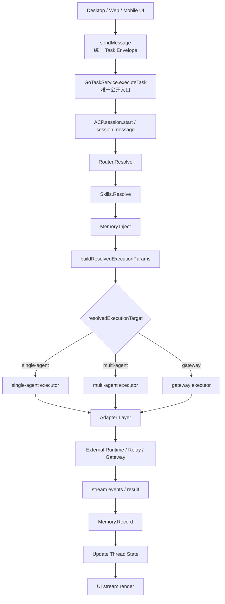

# 任务执行链路统一收敛

Last Updated: 2026-04-08

## 背景

当前仓库里已经存在 `GoTaskService`、Go ACP `Router.Resolve`、`Skills.Resolve`、
`Memory` 与 `buildResolvedExecutionParams`，说明统一控制面已经具备核心骨架。

但旧设计文档长期把不同实现通道写成并列主链，导致：

- Desktop / Web / Mobile 的现状与目标混在一起
- controller 层的历史分流被误认为长期规范
- `gateway` 与显式 `multi-agent` 被描述成 UI 规范入口

本文件把官方口径统一为：

- UI 不变
- `GoTaskService.executeTask` 是唯一公开入口
- ACP 是统一控制面
- `single-agent / multi-agent / gateway` 是 ACP 解析后的执行器分支

## 当前事实

### Desktop

### Web

### Mobile

## 目标态

## 协议约束

### 传输协议

- local / loopback 允许 `ws://` 或 `http://`
- remote 必须使用 `wss://` 或 `https://`
- remote 模式禁止静默降级到非 TLS

### ACP contract

- websocket endpoint 规范路径：`/acp`
- RPC endpoint 规范路径：`/acp/rpc`
- base URL 派生时必须避免重复拼接 `/acp`

## 收敛原则

### Current implementation note

- 当前实现可能仍残留历史分流代码
- 这些实现痕迹不再代表规范

### Target architecture rule

- 所有正常发送请求都先进入 `GoTaskService.executeTask`
- 所有任务都先进入 ACP 控制面，再解析到 executor

### Compatibility route (removed from target)

- `openClawTask` 不再属于目标架构
- `GatewayRuntime`、`Web relay`、`GatewayAcpClient` 只作为 adapter/executor 能力存在

## 分阶段方向

1. 文档口径收敛
2. Dart 请求模型统一
3. route 决策内收到 `GoTaskService` / ACP
4. `gateway` 成为 ACP executor
5. `multi-agent` 成为统一请求语义
