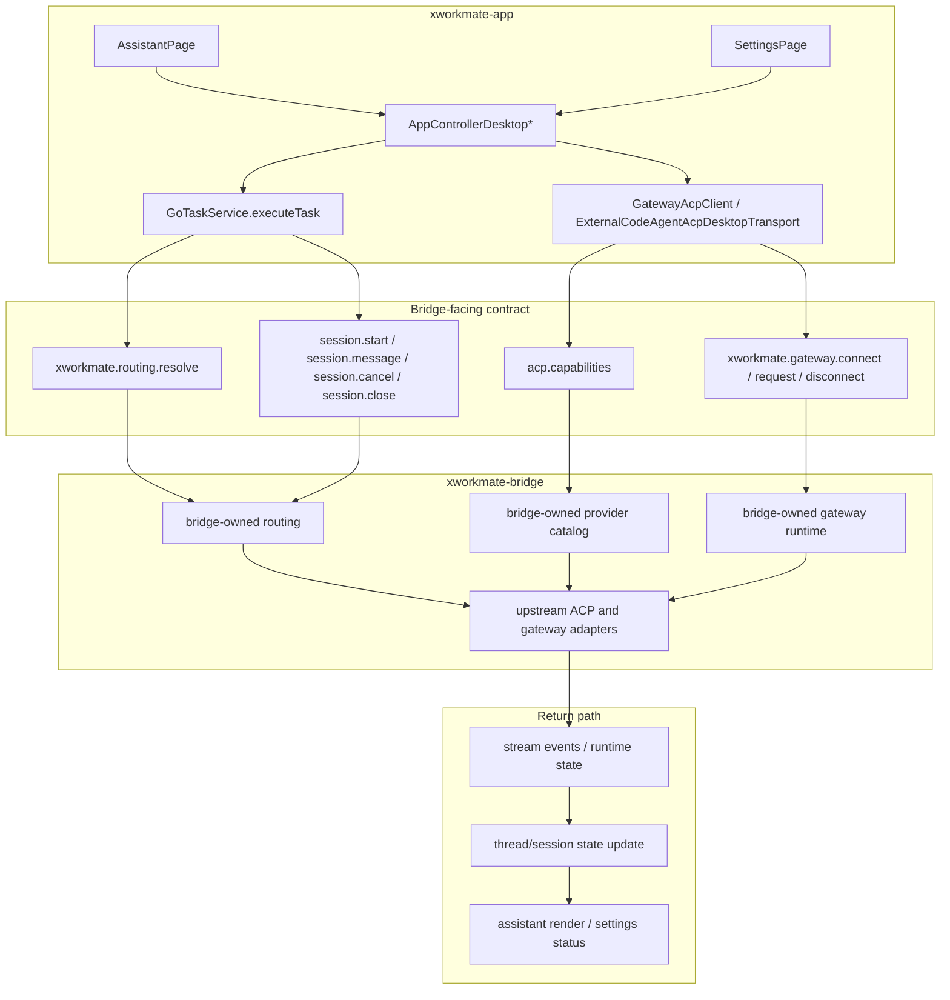

# Task Control Plane Unification

Last Updated: 2026-04-13

## Background

当前 `xworkmate-app` 的主链已经不是“多模块并列入口”模型，而是：

- shell 只保留 `assistant + settings`
- assistant 负责线程、任务、结果与 bridge task/runtime 主链
- settings 负责 bridge connection、account sync、integration affordance
- app 不再维护本地 provider preset、旧 gateway 直连叙述、模块页矩阵

本文件定义的统一口径是：

- app 内任务入口统一走 `GoTaskService.executeTask`
- bridge capability / routing / gateway runtime 由 `xworkmate-bridge` 提供
- app 只消费 bridge 合同，不重建第二套 provider/gateway 真源

## Canonical Mainline

## App-Side Truth Sources

### Surface Truth

- `feature_flags.yaml -> UiFeatureManifest / AppCapabilities -> Shell / Registry` 是唯一 surface 事实源
- app 不再把 provider topology、gateway backend、旧模块入口写成 shell 级分类

### Provider Truth

- `acp.capabilities.providerCatalog` 是 assistant provider picker 的唯一上游真源
- 持久化在线程上的 `providerId` 只表示用户历史选择，不负责反向生成 catalog
- provider unavailable 文案与 resolved provider 都来自 `xworkmate.routing.resolve`
- 任务对话模式的 provider 菜单按 execution target 分流：
  - `agent` 只展示 bridge-owned provider catalog，即 `codex / opencode / gemini`
  - `gateway` 只展示 canonical gateway provider，即 `OpenClaw`
- 这里不保留旧的 provider matrix、preset fallback 或双真源选择路径

### Gateway Truth

- gateway runtime 可见性、连接状态、mount target discovery 都由 bridge capability / runtime snapshot 驱动
- `xworkmate.gateway.*` 是 gateway runtime 的稳定 app-facing 方法族
- app 不再把 production gateway endpoint、fallback endpoint、local preset 当真源

## Mainline Rules

1. Assistant 所有正常任务都先进入 `GoTaskService.executeTask`。
2. Settings 只管理 bridge connection 参数、account sync 元数据与 gateway/integration affordance。
3. provider catalog、routing resolve、gateway runtime state 都由 bridge 提供。
4. bridge 若暴露额外 capability flag 或协作模式，它们属于合同元数据，不自动抬升为 app shell / module taxonomy。
5. app 不直接调用 `acp-server.svc.plus/*`、`openclaw.svc.plus` 等 upstream 地址。

## Removed From Target

- `TasksPage`、`SkillsPage`、`ModulesPage` 之类独立 surface 叙述
- `local / remote / preset / fallback` 作为 app 一级执行路径心智
- “app 自己维护 provider matrix，再把 bridge 当可选后端”的旧设计
- 通过 alias、compat 分流去保留旧模块入口

## See Also

- [XWorkmate Core Module Inventory](/Users/shenlan/workspaces/cloud-neutral-toolkit/xworkmate-app/docs/architecture/xworkmate-core-module-inventory-2026-04-13.md)
- [Settings Integration Configuration Model](/Users/shenlan/workspaces/cloud-neutral-toolkit/xworkmate-app/docs/architecture/settings-integration-configuration-model.md)
- [ACP Forwarding Topology](/Users/shenlan/workspaces/cloud-neutral-toolkit/xworkmate-bridge/docs/architecture/acp-forwarding-topology.md)
