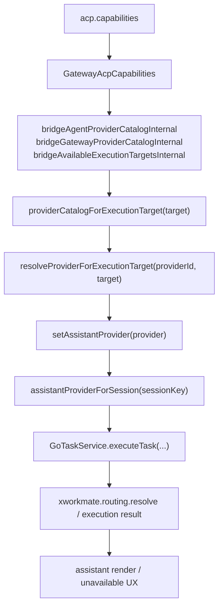

# Task Dialog Provider Selection Mainline

Last Updated: 2026-04-14

## Purpose

本文件定义当前 `xworkmate-app` 任务对话框里 provider 选择的唯一有效口径。

目标是消除旧的 `single-agent` / 本地 provider matrix / gateway 单项硬编码心智，统一到当前已经落地的 bridge-driven 主链。

## Canonical Terms

- 任务对话模式当前只保留两类一级目标：`agent` / `gateway`
- `single-agent` 只允许作为历史文档或低层兼容解析语义存在，不再作为当前 UI、架构说明或设计文档的主术语
- provider catalog 的真源是 `xworkmate-bridge` 返回的 capability contract，不是 app 本地常量、线程历史值或 preset

## Canonical App-Side Flow

当前 app 内任务对话框 provider 选择主链固定为：

- `providerCatalogForExecutionTarget(...)`
- `resolveProviderForExecutionTarget(...)`
- `setAssistantProvider(...)`

不再保留：

- `setAssistantSingleAgentProvider(...)`
- `resolveAssistantProvider(...)`
- `assistantProviderCatalogForDisplay`
- 任何从线程历史 provider 反推 catalog 的路径

## Catalog Rules

### Agent Catalog

- `agent` catalog 只对应 bridge `providerCatalog` 中的 `agent` 目标 provider
- 它代表 ACP server bridges，例如当前 bridge 广告的 `codex / opencode / gemini`
- app 不在本地伪造 `codex / opencode / gemini` 默认列表

### Gateway Catalog

- `gateway` catalog 只对应 bridge 返回的 gateway provider 列表
- 当前 bridge 广告的是 `openclaw`
- 将来 bridge 可以继续扩展 `hermes` 等 gateway provider，app 只消费返回值，不做前端写死
- app 不再把 `openclaw` 当作 gateway 唯一硬编码入口

## Persistence And Fallback Rules

- 线程只持久化用户选择的 `executionTarget` 与 `providerId`
- 持久化值只表示“历史选择”，不反向生成 provider 菜单
- 当线程保存的 `providerId` 不在当前 target catalog 里时：
  - 若当前 target catalog 非空，使用当前 catalog 可解析出的 provider
  - 若当前 target catalog 为空，显示 unavailable placeholder
- bridge 没有返回 catalog 时，provider 菜单为空或禁用；app 不伪造 `codex / opencode / gemini / openclaw`

## Display Metadata Rules

- provider 展示优先消费 bridge 返回的 `label`、`providerDisplay.badge`、`providerDisplay.logoEmoji` 等元数据
- 只有 bridge 未提供显示元数据时，app 才使用通用 badge fallback
- runtime/provider fallback 命名统一使用通用 provider 语义，不再保留 “single-agent provider fallback” 文档口径

## Documentation Replacement Rule

从 2026-04-14 起，以下文档中的现行口径都应以本文为准：

- [Task Control Plane Unification](/Users/shenlan/workspaces/cloud-neutral-toolkit/xworkmate-app/docs/architecture/task-control-plane-unification.md)
- [Settings Integration Configuration Model](/Users/shenlan/workspaces/cloud-neutral-toolkit/xworkmate-app/docs/architecture/settings-integration-configuration-model.md)
- [XWorkmate Core Module Inventory](/Users/shenlan/workspaces/cloud-neutral-toolkit/xworkmate-app/docs/architecture/xworkmate-core-module-inventory-2026-04-13.md)
- [APP 侧对齐当前 xworkmate-bridge API](/Users/shenlan/workspaces/cloud-neutral-toolkit/xworkmate-app/docs/feature/2026-04-11-app-bridge-api-alignment.md)

历史报告、发布记录和旧验收记录允许保留当时的 `single-agent` 叙述，但它们不再定义当前主链。
