# TaskThread SessionKey 隔离修正（2026-03-29）

本文补充并修正 XWorkmate 当前“任务线 / 线程 / 工作目录”设计中的一个关键约束：

- 左侧任务线不能只是派生 UI 项
- 每个可执行任务线都必须先落成真实 `TaskThread`
- 每个可执行任务线都必须绑定独立、稳定的 `sessionKey`
- single-agent 的 `workingDirectory` 只能从该 `sessionKey` 对应的 `TaskThread.workspaceBinding` 读取

本文是对现有 `TaskThread` 主模型的补充，不替代：

- `assistant-thread-target-model-20260328.md`
- `assistant-thread-information-architecture.md`

## 1. 问题定义

当前实现里，single-agent 可执行工作目录实际由以下链路决定：

```text
currentSessionKey
-> normalizedAssistantSessionKeyInternal(sessionKey)
-> assistantWorkspacePathForSession(sessionKey)
-> resolveSingleAgentWorkingDirectoryForSessionInternal(sessionKey)
-> GoTaskServiceRequest.workingDirectory
```

这条链路说明：

1. 真正决定执行目录的是 `sessionKey`
2. prompt 文本不会创建 first binding，也不会覆盖当前线程绑定
3. 空 `sessionKey` 会被归一为 `main`
4. 一旦多个任务线没有真正切换到独立 `sessionKey`，它们就会共享 `main`

因此，现象上即使 UI 展示出多个“任务线”，底层也可能仍然只有一条真正可执行线程：

- `main`
- `settings.workspacePath/.xworkmate/threads/main`

这会直接导致：

- 每个任务线没有自己的本地工作目录
- single-agent 请求继续复用 `threads/main`
- 右栏显示、消息上下文、技能选择和工作区记录都可能混叠到同一线程

## 2. 修正结论

本轮设计修正后的主结论如下：

1. “任务线”不是纯展示概念，而是 `TaskThread` 的 UI 呈现。
2. 每个可执行任务线必须有自己的 `TaskThread.threadId`。
3. `TaskThread.threadId` 就是该任务线的 `sessionKey`。
4. 任何可触发执行的入口都不得在空 `sessionKey` 下运行。
5. 对非主线程任务线，禁止 silent fallback 到 `main`。
6. prompt `workspace_root` 不是线程身份，也不再参与主链更新；`workspaceBinding` 只能由显式 create/load 绑定或结构化执行结果回写更新。

换句话说：

```text
Task Line == TaskThread == sessionKey == threadId
```

只要这四者没有对齐，任务线隔离就是伪隔离。

## 3. 设计目标

本修正要保证以下目标：

### 3.1 身份目标

- 每个任务线都有稳定身份
- 该身份可持久化、可恢复、可切换
- UI 当前选中的永远是 `TaskThread.threadId`

### 3.2 执行目标

- single-agent 执行只读取当前线程自己的 `workspaceBinding.workspacePath`
- 不允许从消息文本、派生视图或全局临时状态猜测目标线程
- 不允许把未绑定线程默认送到 `main`

### 3.3 信息一致性目标

- 左栏任务线
- 主体消息区
- 右栏工作路径
- 技能选择
- provider 返回回写

以上信息必须围绕同一个 `sessionKey` 聚合。

## 4. 核心约束

### 4.1 任务线创建约束

创建任务线时，必须先分配唯一 `sessionKey`，再允许进入 UI 可执行状态。

推荐形式：

```text
draft:<timestamp-or-ulid>
agent:<agentId>:<baseKey>
```

禁止：

- 仅创建 UI 派生卡片，不创建 `TaskThread`
- 创建后仍停留在空 key
- 通过“后面再补 sessionKey”的方式进入可执行状态

### 4.2 任务线切换约束

用户切换任务线时，必须先完成：

```text
UI selection
-> switchSession(sessionKey)
-> ensureDesktopTaskThreadBindingInternal(sessionKey)
-> read TaskThread(sessionKey)
-> allow execute
```

禁止：

- 任务线视觉上切换了，但 `currentSessionKey` 没变
- 任务线详情来自 A，执行请求却仍发送到 `main`

### 4.3 single-agent 执行约束

single-agent 请求必须满足：

```text
request.sessionId == request.threadId == current TaskThread.threadId
request.workingDirectory == current TaskThread.workspaceBinding.workspacePath
```

禁止：

- 从 prompt 文本中提取 `workspace_root` 或其他 side-channel 直接替代线程身份
- 因 `sessionKey` 缺失而自动转发到 `main`
- 因右栏展示路径存在而绕过线程绑定

### 4.4 fallback 约束

`main` 只能作为“主线程身份”，不能作为“任何未绑定线程的兜底线程”。

因此：

- 空 `sessionKey -> main` 只允许用于真正的主线程初始化阶段
- 非主线程任务线若缺少 `sessionKey`，状态应为 `needs_binding` 或 `not_runnable`
- 本地可执行线程在 create/load 阶段必须已经拥有唯一工作目录
- 不允许继续执行并偷偷落到 `threads/main`

## 5. Workspace 更新的正确角色

运行期 workspace 更新必须通过结构化数据进入主链。

它不是：

- prompt 文本中的 `workspace_root`
- 线程身份
- session 选择器
- 运行时对当前线程的隐式覆盖命令

它只能是：

- create/load 阶段对当前线程 `workspaceBinding` 的显式绑定
- 外部 provider / transport 返回的结构化字段（例如 `resolvedWorkingDirectory` 与 `resolvedWorkspaceRefKind`）对当前线程 binding 的确认更新

因此正确顺序应为：

```text
Structured execution result
-> update current TaskThread.workspaceBinding
-> persist on that TaskThread
-> subsequent execute reads TaskThread.workspaceBinding.workspacePath
```

而不是：

```text
Prompt text side-channel
-> bypass thread binding
-> directly becomes runtime workingDirectory
```

## 6. 修正后的信息流

```mermaid
flowchart LR
  A["创建任务线"] --> B["分配唯一 sessionKey"]
  B --> C["创建 / 更新 TaskThread"]
  C --> D["写入 workspaceBinding / executionBinding / contextState"]
  D --> E["任务线进入可见列表"]

  E --> F["用户切换任务线"]
  F --> G["switchSession(sessionKey)"]
  G --> H["currentSessionKey = TaskThread.threadId"]
  H --> I["ensureDesktopTaskThreadBindingInternal(sessionKey)"]

  I --> J["读取当前 TaskThread"]
  J --> K["workspaceBinding.workspacePath"]
  J --> L["executionBinding"]
  J --> M["contextState"]

  K --> N["GoTaskServiceRequest.workingDirectory"]
  L --> O["provider / execution mode"]
  M --> P["messages / model / skills"]

  N --> Q["single-agent execute"]
  O --> Q
  P --> Q

  Q --> R["provider 返回结果"]
  R --> S["仅回写同一 sessionKey 的 TaskThread"]
```



## 7. 模块修正要求

### 7.1 UI / 任务列表

任务列表中的每个可点击项都必须满足：

- 拥有真实 `sessionKey`
- 该 key 可被 `switchSession(sessionKey)` 命中
- 该 key 能在 `assistantThreadRecordsInternal` 中找到或即时创建对应 `TaskThread`

如果某个列表项没有真实 `sessionKey`，它只能是只读提示项，不能作为可执行任务线。

### 7.2 Thread binding 层

`localThreadWorkspacePathInternal(sessionKey)` 与
`buildDesktopWorkspaceBindingInternal(sessionKey, ...)`
必须建立在“当前 sessionKey 已经真实存在”的前提下。

它们负责：

- 把线程身份映射成稳定目录
- 在同一线程下复用既有 binding

它们不负责：

- 替 UI 猜当前任务线是谁
- 把无 key 任务偷偷归并到 `main`

### 7.3 single-agent 入口

single-agent 入口必须在执行前验证：

1. 当前任务线是不是主线程以外的真实线程
2. `currentSessionKey` 是否已切换完成
3. `workingDirectory` 是否来自当前线程自己的 `TaskThread`

若不满足，应报线程绑定错误，而不是继续执行。

### 7.4 派生任务视图

`DerivedTasksController` 只能消费 session summary，不得反向定义线程身份。

也就是说：

- 它可以显示任务线
- 它可以反映状态
- 它不能成为“当前线程是谁”的真相源

线程身份仍然只能由 `TaskThread.threadId / currentSessionKey` 决定。

## 8. 迁移与兼容

### 8.1 现有 `main` 线程

现有主线程 `main` 继续保留，作为默认主会话。

### 8.2 历史上误共享 `main` 的任务线

对历史数据不做自动拆分迁移，原因是：

- 无法可靠推断哪些 UI 任务线原本应拆成独立线程
- 自动拆分会破坏既有消息上下文和 provider 会话连续性

处理原则：

1. 历史共享 `main` 的记录继续作为 `main`
2. 从修正版本开始，新建任务线必须创建独立 `sessionKey`
3. 对已暴露出共享问题的入口，优先阻止继续 silent fallback，并移除 prompt / runtime side-channel first-binding

### 8.3 未绑定任务线

任何未完成 `sessionKey` 分配或 `TaskThread` 创建的任务线，必须显式显示为：

- 未绑定
- 不可运行
- 需要创建线程

而不是隐式执行到 `main`。

## 9. 验收标准

设计修正完成后，必须满足以下验收标准：

1. 新建两个任务线时，它们生成两个不同 `sessionKey`。
2. 两个任务线的本地目录分别落在不同路径：
   - `.xworkmate/threads/<task-a>`
   - `.xworkmate/threads/<task-b>`
3. 切换任务线后，`currentSessionKey` 与右栏路径同步变化。
4. single-agent 请求里的 `sessionId / threadId / workingDirectory` 始终对应当前线程。
5. 任意非主线程缺少 `sessionKey` 时，执行被阻止，而不是回落到 `main`。
6. workspace 更新只接受结构化回写或显式绑定；prompt-only 文本不会进入线程 binding 主链。

## 10. 与现有架构文档的关系

本文补充的是“线程身份隔离约束”，重点回答：

- 为什么任务线必须先成为真实 `TaskThread`
- 为什么 `sessionKey` 才是 single-agent 工作目录的身份锚点
- 为什么 prompt side-channel 不能替代线程身份或 workspaceBinding

推荐阅读顺序：

1. `assistant-thread-target-model-20260328.md`
2. `assistant-thread-information-architecture.md`
3. `task-thread-session-key-isolation-20260329.md`（本文）
