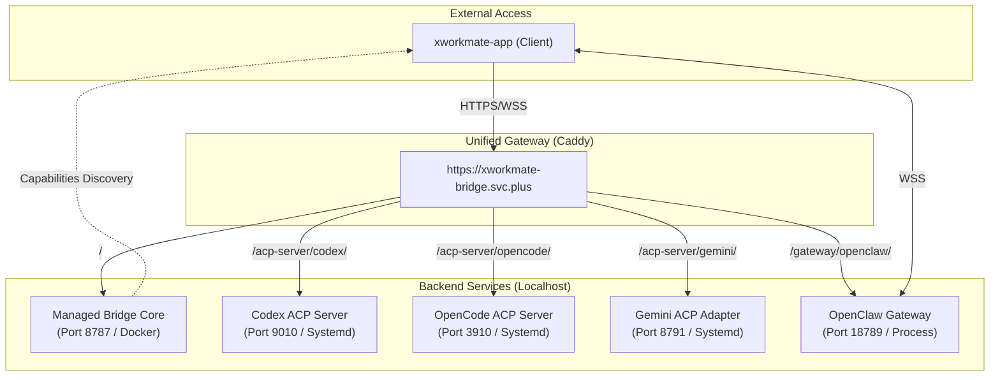

# xworkmate-bridge 统一路由架构文档

## 1. 架构概览 (Unified Routing Architecture)

当前系统采用 `xworkmate-bridge.svc.plus` 作为统一入口，通过 Caddy 进行流量分发与强制鉴权。

## 2. 路由分发规则

| 统一路径 | 转发目标 | 协议类型 | 备注 |
| :--- | :--- | :--- | :--- |
| `/` | `127.0.0.1:8787` | REST/RPC | Managed Bridge 核心，提供能力发现 |
| `/acp-server/codex/` | `127.0.0.1:9010` | JSON-RPC (SSE) | 映射至 Codex Provider |
| `/acp-server/opencode/` | `127.0.0.1:3910` | JSON-RPC (SSE) | 映射至 OpenCode Provider |
| `/acp-server/gemini/` | `127.0.0.1:8791` | JSON-RPC (SSE) | 映射至 Gemini Adapter |
| `/gateway/openclaw/` | `127.0.0.1:18789` | WSS / RPC | 映射至 OpenClaw Gateway |

## 3. 运维配置优化

### 3.1 统一鉴权
所有通过 `xworkmate-bridge.svc.plus` 域名访问的请求（除 Caddy 内部 handle 外）均由 Caddy 强制校验：
- **Header**: `Authorization: Bearer <bridge-auth-token>`
- **未授权响应**: `401 Unauthorized`

### 3.2 SSE / WebSocket 优化
所有反向代理均配置了 `flush_interval -1`，禁用了响应缓冲，以支持低延迟的 SSE 流式输出和稳定的 WebSocket 长连接。

### 3.3 日志持久化 (Docker)
`xworkmate-bridge-managed` 容器已配置日志挂载：
- **宿主机路径**: `/var/log/xworkmate-bridge/`
- **容器路径**: `/app/logs`
- **轮转策略**: 单文件 50MB，保留最近 3 个文件。

## 4. 后端服务启动参考

- **Codex**: `/usr/local/bin/xworkmate-go-core serve --listen 127.0.0.1:9010`
- **OpenCode**: `/usr/local/bin/xworkmate-go-core serve --listen 127.0.0.1:3910`
- **Gemini**: `/usr/local/bin/xworkmate-go-core gemini-acp-adapter --listen 127.0.0.1:8791 ...`
- **Gateway**: `openclaw-gateway run` (Port 18789)
