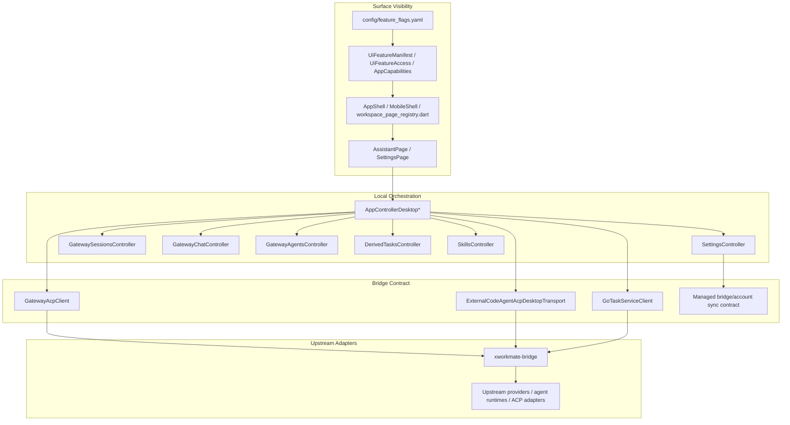
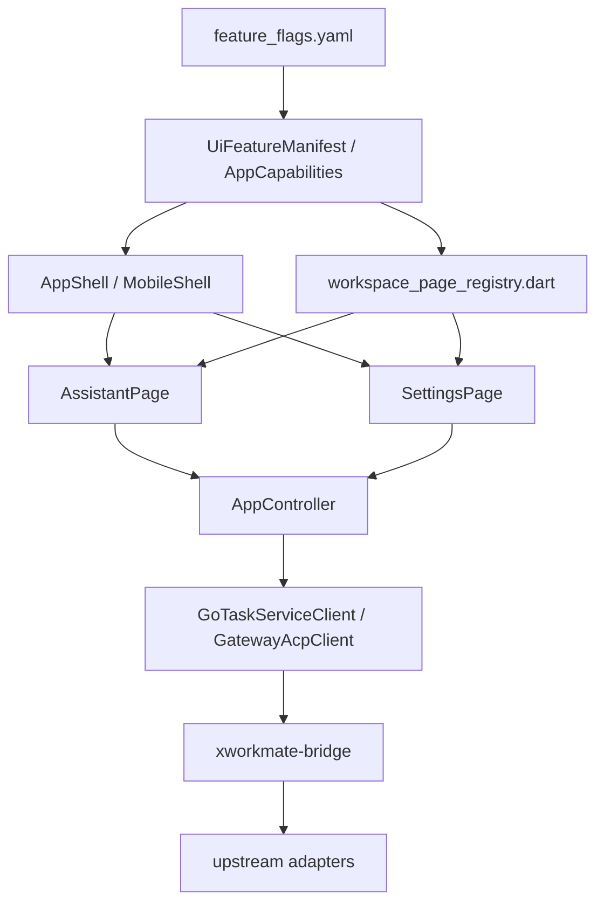

# XWorkmate Core Module Inventory

Last Updated: 2026-04-13

## Repo Context

本仓库当前已经收敛到 `assistant + settings` 双端极简 surface。

- `Desktop APP` 与 `Mobile APP` 顶层都只保留 `assistant`、`settings`
- `feature_flags.yaml` 是 surface 可见性的唯一声明源
- `UiFeatureManifest / UiFeatureAccess / AppCapabilities` 负责把 manifest 解析成当前平台允许能力
- `AppShell / MobileShell` 与 `workspace_page_registry.dart` 已同步收敛到同一口径，不再存在“manifest 允许但 shell/registry 仍保留旧页”的双重真源
- `xworkmate-app` 当前只保留与 `xworkmate-bridge` C/S 主链直接相关的 surface、gate、controller、runtime 合同
- 已删除独立 `tasks / skills / modules / mcp / claw_hub / secrets / ai_gateway / account` 页面入口、alias 路由与对应枚举残留

## Overall Layering

## Surface And Gate Flow

当前真实口径：

- 没有 fallback manifest
- 没有 `secrets -> settings`、`ai_gateway -> settings`、`account -> settings` 兼容别名
- 没有独立 `modules`/`workspace hub`/`fake module matrix`

## Global Summary

`Current Status` 按模块组总体判断；平台差异在后面的 `Desktop APP`、`Mobile APP` 和详细段落中展开。

| Module Group | Current Status | Current Repo Truth |
| --- | --- | --- |
| Desktop APP | Active | 顶层 only `assistant + settings` |
| Mobile APP | Active | 顶层 only `assistant + settings` |
| Assistant | Active | 保留 bridge/runtime 主链与任务/技能数据面 |
| Settings | Active | 保留 bridge/account/integration 主链 |
| Tasks | Removed surface | 不再有独立页面，仅保留 assistant/task-state 数据 |
| Modules | Removed surface | 不再有独立页面、tab、registry、alias |

## Desktop APP (macOS / Linux / Windows)

Status: `Active`

- 桌面顶层 shell 只保留 `assistant`、`settings`
- `workspace_page_registry.dart` 只注册 `assistant`、`settings`
- 不再保留 `tasks / skills / modules / mcp / claw_hub / account` 独立桌面入口
- 设置相关 bridge/account/integration 操作全部收口到 `SettingsPage`
- Assistant 仍然承载完整 desktop bridge/runtime 主链

## Mobile APP (iOS / Android)

Status: `Active`

- 移动端顶层 tab 只保留 `assistant`、`settings`
- 删除 `workspace / tasks / secrets` 顶层 tab
- 删除 `MobileWorkspaceLauncherInternal`
- 配对、Bridge connect、setup code 等流程保留为 `settings` detail flow 与 mobile-safe strip/sheet 能力，不再占独立 top-level surface

## Assistant

Status: `Active`

保留的主链 runtime / controller：

- `GatewayAcpClient`
- `ExternalCodeAgentAcpDesktopTransport`
- `GoTaskServiceClient`
- `GatewaySessionsController`
- `GatewayChatController`
- `GatewayAgentsController`
- `DerivedTasksController`
- `SkillsController`

当前 Assistant 事实：

- provider catalog 只来自 bridge capabilities，不再恢复任何 preset / backfill / fallback provider truth
- task state 仍在 assistant 内被消费，但不再拥有独立 `TasksPage`
- skills 数据仍在 assistant 内被消费，但不再拥有独立 `SkillsPage`
- assistant focus 只保留仍有真实落点的 `settings / language / theme`

## Settings

Status: `Active`

当前设置面已经收敛为单一 bridge/settings 主链：

- `SettingsTab` 只保留 `gateway`
- `SettingsDetailPage` 只保留 `gatewayConnection`
- `SettingsNavigationContext` 只保留当前真实 detail flow 所需字段
- 账户登录、MFA、同步与 managed bridge contract 回写都收口在 `SettingsPage + SettingsAccountPanel`

已删除的旧设置残留：

- `ModulesTab`
- `SecretsTab`
- `AiGatewayTab`
- `aiGatewayIntegration`
- `externalAgents`
- `diagnosticsAdvanced`
- `vaultProvider`

## Tasks

Status: `Removed surface`

保留范围仅限 assistant/task-state 数据面：

- `DerivedTasksController`
- `DesktopTaskThreadRepository`
- assistant 内部 task rail / session/task 聚合

已删除：

- `TasksPage`
- 顶层 `WorkspaceDestination.tasks`
- `MobileShellTab.tasks`

## Modules

Status: `Removed surface`

已删除：

- `ModulesPage`
- `SkillsPage`
- `McpServerPage`
- `ClawHubPage`
- `WorkspaceDestination.skills / nodes / agents / mcpServer / clawHub`
- `openModules` / module alias navigation API
- `workspace_page_registry` 中所有模块类 destination spec

同时清理的孤儿 controller：

- `InstancesController`
- `ConnectorsController`

## Architecture Review Suggestions

- 继续坚持 `feature_flags.yaml -> UiFeatureManifest/AppCapabilities -> Shell/Registry` 的单一 surface 事实源，不再引入第二套 alias 或 dormant registry。
- `xworkmate-app` 不再维护独立模块壳；任何新的 bridge 能力都只能落到 `assistant` 或 `settings`，不能恢复 `tasks/modules/...` 独立 page matrix。
- provider、routing、bridge endpoint、managed account sync 的真源继续归 `xworkmate-bridge` 合同与同步链拥有，app 只做消费与最小本地编排。
- 不再维护兼容 alias、休眠 destination、伪模块矩阵；发现新的 `legacy / fallback / compat` 残留时，默认动作仍然是删除而不是保留占位。 
