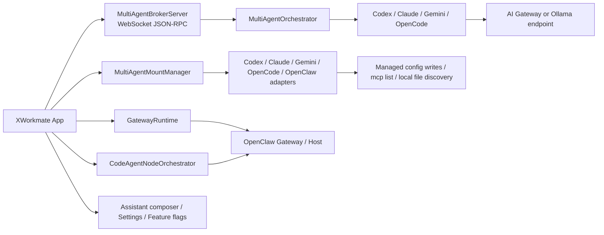

# XWorkmate 集成架构

## 概述

XWorkmate 现阶段已经不只是“单一 Codex bridge”，但当前实现也不是一个单独的 “Discovery / Distribution Catalog” 模块。

当前集成能力分散在几条明确的实现路径里：

1. `GatewayRuntime`
   - 负责 OpenClaw Gateway 的实时 RPC、会话、chat、pairing、cron
2. `MultiAgentBrokerServer` + `MultiAgentOrchestrator`
   - 负责多 Agent 协作运行
3. `MultiAgentMountManager`
   - 负责按 adapter 做 CLI 能力探测、MCP reconcile、挂载状态汇总
4. `CodexConfigBridge` / `OpencodeConfigBridge`
   - 负责特定 CLI 的配置文件写入
5. Assistant composer 与 feature flags
   - 决定当前哪些集成入口真实对用户可见

也就是说，当前架构更接近“分布式集成面”，不是单一 catalog service。

## 当前架构基线

关键点：

- `MultiAgentBroker` 是多 CLI 协作的本地运行时入口。
- `OpenClaw` 既是现有 Gateway 集成面，也是当前 app-mediated code-agent dispatch 的宿主控制面。
- `AI Gateway` 既可以是 direct AI 对话入口，也可以是协作运行的注入式模型入口。
- 当前没有一个单独命名为 `Discovery / Distribution Catalog` 的实现模块。

## 1. OpenClaw Gateway / Host

用途：

- 运行时协同
- 设备与信任边界
- Agent / Session / Chat 通道
- 宿主控制面发现

已使用能力：

- `health`
- `status`
- `agents.list`
- `sessions.list`
- `chat.send`
- `device.pair.*`
- `cron.list`
- `agent/register`
- `memory/sync`

当前定位：

- 继续作为 Gateway RPC 面存在
- 也是 app-mediated code-agent dispatch 的控制面目标
- 在 mount 视角下，OpenClaw 目前更多是“本地发现 + 宿主控制面”，不是一个统一的 skills / plugins catalog service

## 2. AI Gateway

用途：

- direct AI 对话入口
- 协作运行时的模型注入入口
- 对部分 CLI 的配置桥接入口

边界：

- 不负责设备配对
- 不负责 session / agent 生命周期
- 不替换用户现有默认 provider / model

当前策略：

- `CodexConfigBridge` 可以写入受管 provider / MCP block
- `MultiAgentOrchestrator` 在协作运行中会通过环境变量或 `ollama launch` 传递模型入口
- `Claude / Gemini` 的 mount reconcile 目前主要做 discovery，AI Gateway 仍保持 launch-scoped
- `OpenCode` 当前有受管 MCP config；AI Gateway 语义仍偏 launch-scoped / runtime injection

换句话说，AI Gateway 能力是分散落地的，不是所有 CLI 都通过同一条托管 provider 路径接入。

## 3. Multi-Agent Runtime

### 编排层

`MultiAgentOrchestrator` 负责：

- Architect 任务分析
- Engineer 实现
- Tester / Doc 审阅
- 迭代评分与回退

### Broker 层

`MultiAgentBroker` 负责：

- 本地 `WebSocket JSON-RPC`
- run lifecycle
- worker CLI 启动
- selected skills / MCP / Gateway 上下文注入
- 结构化事件流回写当前会话

### UI 接线

- Assistant 继续复用现有 composer、附件、当前会话
- 桌面端真正对用户可见的协作入口，当前主要是 Assistant composer 上的协作 toggle
- `SettingsPage` 里有 Multi-Agent 配置区块与 detail 页面代码，但桌面端 `settings.agents` 仍被 feature flag 关闭
- 不新增独立任务页面

## 4. 发现与分发

当前实现里，`managed / external` 更像一套按 adapter 执行的操作规则，而不是单独的中心化状态目录。

XWorkmate 仍然区分两类对象：

- `managed`
  - 由 App 创建与维护的托管项
- `external`
  - 外部已有配置或 CLI 自带配置

统一规则：

- 只更新 XWorkmate 托管项
- 不删除外部已有项
- 启动时与保存设置后自动 reconcile
- 这套规则当前由 `MultiAgentMountManager` 在各 adapter 上分别执行

## 5. 挂载入口矩阵

| 目标 | Skills 挂载入口 | MCP 挂载入口 | AI Gateway 挂载入口 |
| --- | --- | --- | --- |
| OpenClaw | 本地文件 / 目录发现 + Gateway 控制面 | 不作为 MCP 主挂载点 | app-mediated dispatch / gateway route |
| Codex | 当前线程 skills 上下文 +协作运行注入 | `~/.codex/config.toml` 受管 MCP block | 受管 provider bridge + runtime injection |
| Claude | 当前线程 skills 上下文 +协作运行注入 | `claude mcp list` 做 discovery | launch-scoped / env / `ollama launch` |
| Gemini | 当前线程 skills 上下文 +协作运行注入 | `gemini mcp list` 做 discovery | launch-scoped / env |
| OpenCode | 当前线程 skills 上下文 +协作运行注入 | `~/.opencode/config.toml` 受管 MCP block | runtime injection |

## 6. 外部 Provider 与执行路径

保留现有统一 contract：

- `ExternalCodeAgentProvider.id`
- `name`
- `command`
- `defaultArgs`
- `capabilities`
- `CodeAgentNodeOrchestrator.buildGatewayDispatch()`

现状：

- `codex` 仍是当前最完整 provider
- 其他 CLI 当前主要通过 `CliMountAdapter` discovery / reconcile 与 `MultiAgentOrchestrator` 运行时调用接入
- 多 provider 调度 UI 不是当前交付目标

## 7. 安全边界

- `.env` 仅用于开发预填充，不自动连接，不作为持久化真值源
- AI Gateway API Key 与 Gateway 凭证继续走 secure storage
- 新增协作路径不得把 secret 写入 `SharedPreferences`
- Launch-scoped 注入优先于全局配置改写
- 远程 Gateway 不允许静默降级为非 TLS
- 协作事件与 metadata 不上传本地 secret 或本机绝对路径

## 8. 设置页统一动作语义（Gateway 家族）

`OpenClaw Gateway`、`Vault`、`AI Gateway`（以及后续外部扩展）统一遵循同一操作语义：

- `Test`：只使用当前草稿（含当前输入的临时 secret 覆盖）做连通性校验，不写入持久层。
- `Save`：把草稿同步到本地持久存储（`SettingsStore` + `SecretStore`），不立即改变运行时会话行为。
- `Apply`：在 `Save` 的基础上，立即让当前运行时按新配置生效。

实现约束：

- Gateway 集成页不再重复显示顶层全局 `Save / Apply`，避免与卡片内动作语义冲突。
- 桌面端 `settings.gateway_setup_code` 与 `settings.agents` 当前都被 feature flag 关闭。
- 但桌面端 `assistant.multi_agent` 仍然开启，所以协作入口当前主要暴露在 Assistant composer，而不是设置页独立标签。

## 相关代码

- `lib/app/app_controller_desktop.dart`
- `lib/app/app_controller_web.dart`
- `lib/features/assistant/assistant_page.dart`
- `lib/features/settings/settings_page.dart`
- `lib/runtime/gateway_runtime.dart`
- `lib/runtime/runtime_models.dart`
- `lib/runtime/multi_agent_orchestrator.dart`
- `lib/runtime/multi_agent_broker.dart`
- `lib/runtime/multi_agent_mounts.dart`
- `lib/runtime/codex_config_bridge.dart`
- `lib/runtime/opencode_config_bridge.dart`
- `lib/runtime/code_agent_node_orchestrator.dart`
- `lib/runtime/runtime_coordinator.dart`
