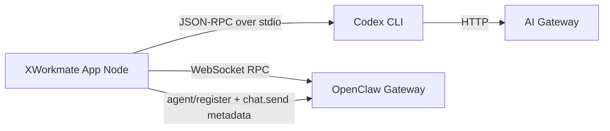

# XWorkmate 集成架构

## 概述

XWorkmate 当前有三组独立但可组合的集成面：

1. **OpenClaw Gateway**
   - 设备配对
   - Agent 列表与聊天
   - `cron.list` 只读任务视图
   - `memory/sync` 同步能力
2. **AI Gateway**
   - 统一模型入口
   - 模型目录同步
   - 给 Codex CLI 提供模型桥接
3. **Code Agent Runtime**
   - 当前唯一可交付路径是外部 `Codex CLI`
   - 内置 Rust FFI 仍是 future work
   - 所有 runtime 都挂在 `XWorkmate App node` 后面，而不是直接挂到 Gateway

## 当前真实链路

关键点：

- `Codex CLI` 不直接连接 `OpenClaw Gateway`
- `XWorkmate App` 是唯一的 cooperative node
- 本地内置/扩展/外部 CLI 都是 node 后端 runtime
- AI Gateway 与 OpenClaw Gateway 是两套不同职责的集成面

## 1. OpenClaw Gateway

用途：运行时协同、响应返回和设备信任边界。

当前已用到的能力：

- `health`
- `status`
- `agents.list`
- `sessions.list`
- `chat.send`
- `device.pair.*`
- `cron.list`
- `agent/register`
- `memory/sync`

当前产品边界：

- Scheduled Tasks 只读展示 `cron.list`
- Memory 只暴露同步语义，不提供 CRUD UI
- 远程模式必须保持 TLS 显式配置
- Gateway 接收到的是来自 `XWorkmate App node` 的交互和 metadata，不是 CLI 直连 RPC

## 2. AI Gateway

用途：为外部 Codex CLI 提供统一模型桥接。

当前链路：

1. 用户在设置中配置 AI Gateway URL、模型和 API Key。
2. `CodexConfigBridge` 把配置写入 `~/.codex/config.toml`。
3. 外部 `codex app-server` 通过该配置把推理请求转发到 AI Gateway。

这部分不负责：

- 设备配对
- 任务调度
- Agent 注册

## 3. Code Agent Runtime

### 当前可用路径

- `RuntimeCoordinator`
- `CodexRuntime.startStdio()`
- `ExternalCodeAgentProvider`
- `CodeAgentNodeOrchestrator`

已支持：

- 显式启用 / 停用 bridge
- 手动覆盖 Codex 二进制路径
- Gateway 已连接时注册为 `code-agent-bridge`
- `chat.send` 携带 node / provider / bridge dispatch metadata
- 为未来其他外部 CLI 预留统一 provider contract

### 当前不可用路径

Built-in Codex / Rust FFI 仍不可用。

现状：

- `builtIn` 只保留配置位
- UI 只显示 `Experimental / Unavailable`
- Rust FFI 核心 TODO 尚未补完

## 4. 外部 Provider 预留

当前统一 contract：

- `ExternalCodeAgentProvider.id`
- `name`
- `command`
- `defaultArgs`
- `capabilities`
- `CodeAgentNodeOrchestrator.buildGatewayDispatch()`

当前 active provider：

- `codex`

暂不实现：

- provider 切换 UI
- capability discovery UI
- 多 provider 调度策略

## 5. 安全边界

- `.env` 仅用于开发预填充，不自动连接，不作为持久化真值源
- AI Gateway API Key 和 Gateway 凭证继续走 secure storage
- 外部 Codex CLI 路径仅保存文件路径，不保存 secret
- `chat.send` 的 node metadata 仅上传 node/provider 状态，不上传 Gateway secret 或本地 CLI 绝对路径
- 远程 Gateway 不允许静默降级为非 TLS

## 相关代码

- `lib/app/app_controller.dart`
- `lib/runtime/runtime_coordinator.dart`
- `lib/runtime/codex_runtime.dart`
- `lib/runtime/codex_config_bridge.dart`
- `lib/runtime/code_agent_node_orchestrator.dart`
- `lib/runtime/agent_registry.dart`
- `lib/runtime/gateway_runtime.dart`
