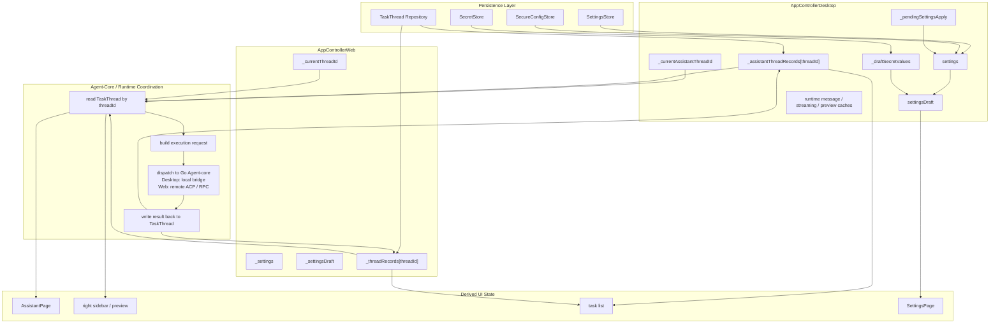
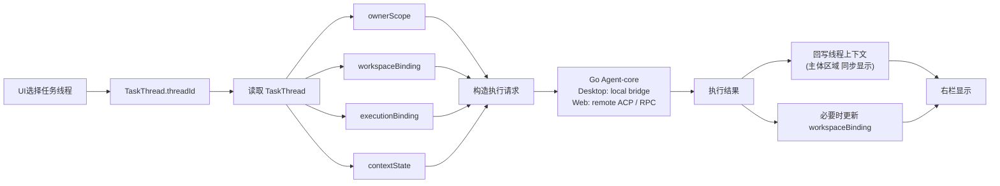

# XWorkmate App Internal State Architecture

Last Updated: 2026-03-29

## Purpose

本文定义当前 XWorkmate 的内部状态组织，重点说明以下对象之间的关系：

- Settings 中心配置状态
- 当前 `TaskThread` 状态
- agent-core / runtime 协调状态
- 派生 UI 状态
- 技能、模型、执行通道与会话内容

本文以 Desktop 为主说明，因为 Desktop 控制器拥有最完整的运行时与持久化路径；Web 保持同一 `TaskThread` 与 session 语义，但 transport 走远端 ACP / RPC。

## 1. Core Rule

当前内部状态只有两层主状态和一层派生状态：

- Layer A: Settings 中心配置状态
- Layer B: `TaskThread` 线程状态
- Layer C: 派生 UI 状态

最重要的规则是：

Settings 不是当前线程状态。

Settings 负责默认值、集成配置和持久化快照。
`TaskThread` 负责当前线程真实使用的工作空间、执行通道、上下文和生命周期。
UI 必须从解析后的 `TaskThread` 渲染，而不是只从 Settings 渲染。

## 2. Internal State Diagram

读图规则：

- `TaskThread` 是线程主状态，不再由散落 session 字段共同充当
- `threadId` 是读取线程状态的唯一入口键
- `build execution request` 属于 agent-core / runtime 协调层
- UI 只消费当前 `TaskThread` 与派生状态

## 3. State Ownership

### 3.1 Settings 中心配置状态

Primary owners:

- `lib/app/app_controller_desktop.dart`
- `lib/app/app_controller_web.dart`

Primary fields:

- `settings`
- `settingsDraft`
- `_settingsDraftInitialized`
- `_draftSecretValues`
- `_pendingSettingsApply`
- `settings.gatewayProfiles`
- `settings.assistantExecutionTarget`
- `settings.assistantLastThreadId`

Responsibilities:

- 保存全局默认配置
- 保存集成配置与安全引用
- 保存新线程创建时要继承的默认执行配置
- 保存不属于单个线程的 app 级偏好

重要规则：

- Settings 负责默认值，不负责当前线程的真实运行状态
- Settings 不应被当作主体区域、右栏或线程执行的事实来源

### 3.2 TaskThread 线程状态

Primary owners:

- Desktop: `lib/app/app_controller_desktop.dart`
- Web: `lib/app/app_controller_web.dart`

Primary in-memory stores:

- Desktop: `_assistantThreadRecords[threadId]`
- Web: `_threadRecords[threadId]`

Primary schema:

- `TaskThread`

Current authoritative fields:

- `threadId`
- `ownerScope`
- `workspaceBinding`
- `executionBinding`
- `contextState`
- `lifecycleState`

Ownership summary:

- `ownerScope`
  - 线程归属与 owner 维度信息
- `workspaceBinding.workspacePath / displayPath / workspaceKind`
  - 执行空间与右栏路径信息
- `executionBinding.executionMode / providerId / endpointId`
  - 执行通道与连接目标
- `contextState.messages / selectedModelId / importedSkills / selectedSkillKeys / permissionLevel / messageViewMode`
  - 线程上下文与主体区域内容
- `lifecycleState.archived / status / lastRunAtMs / lastResultCode`
  - 生命周期摘要与结果摘要

重要规则：

- 如果值已经存在于 `TaskThread`，则线程值优先于 Settings 默认值
- `TaskThread` 是当前线程展示与执行的唯一主对象
- `TaskThread` 在 create/load 时必须已经拥有完整 `workspaceBinding`
- 缺少 `workspaceBinding` 的旧记录属于非法线程数据，应在恢复阶段跳过并通过启动告警暴露

### 3.3 Agent-Core / Runtime 协调状态

Primary responsibilities:

- 根据 `threadId` 读取完整 `TaskThread`
- 基于 `ownerScope / workspaceBinding / executionBinding / contextState` 构造执行请求
- 调度到 `Go Agent-core`
- 接收执行结果并回写 `TaskThread`

重要规则：

- 请求构造不属于 UI
- Flutter UI 不直接承担 runtime dispatch 职责
- 工作空间选择不再通过旧式运行前猜测获得
- 不允许 runtime fallback 到 `main`、`Directory.current` 或 prompt first-binding
- 结果回写先更新线程上下文，再驱动主体区域与右栏刷新
- Desktop / Web 共用相同 session 生命周期；不再单独发明 relay-only 执行协议

### 3.4 Derived UI State

Primary owners:

- `lib/features/assistant/assistant_page.dart`
- `lib/features/settings/settings_page.dart`

Examples:

- task list
- 主体区域消息显示
- 右栏路径、预览与结果面板
- connection chip
- skill panel
- model label

重要规则：

- UI 是派生状态，不是线程事实源
- UI 保持现有结构不变，但所有线程显示都应从当前 `TaskThread` 派生

## 4. Resolution Priority

### 4.1 当前线程读取优先级

1. UI 选择 `threadId`
2. 控制器 / runtime 读取 `TaskThread`
3. 若线程字段缺失，才回退到 Settings 中心默认值用于初始化或补全

这意味着：

- Settings 是默认值来源，不是当前线程真相源
- 当前线程的执行模式、模型、技能、工作空间都以 `TaskThread` 为准

### 4.2 执行请求构造优先级

1. `ownerScope`
2. `workspaceBinding`
3. `executionBinding`
4. `contextState`

然后由 agent-core / runtime 协调层构造执行请求并调度运行。

### 4.3 结果回写优先级

1. 回写 `contextState`
2. 主体区域同步显示
3. 必要时更新 `workspaceBinding`
4. 右栏读取最新 `TaskThread` 记录并刷新

## 5. Lifecycle Baseline

这条主链同时约束：

- 控制器的线程读取逻辑
- runtime 的请求构造与调度逻辑
- 主体区域消息刷新逻辑
- 右栏预览与结果展示逻辑

## 6. 文档边界

- [assistant-thread-target-model-20260328.md](/Users/shenlan/workspaces/cloud-neutral-toolkit/xworkmate-taskthread-docs-naming-cleanup/docs/architecture/assistant-thread-target-model-20260328.md)
  负责说明 `TaskThread` 当前模型与生命周期主链。
- [assistant-thread-information-architecture.md](/Users/shenlan/workspaces/cloud-neutral-toolkit/xworkmate-taskthread-docs-naming-cleanup/docs/architecture/assistant-thread-information-architecture.md)
  负责说明线程信息如何进入 UI、请求构造与结果回写。

归档文档只保留为历史背景，不再作为当前内部状态设计依据。
