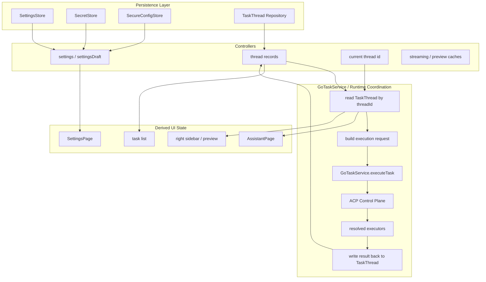

# XWorkmate App Internal State Architecture

Last Updated: 2026-04-08

## Purpose

本文定义当前 XWorkmate 的内部状态组织，重点说明以下对象之间的关系：

- Settings 中心配置状态
- `TaskThread` 线程状态
- `GoTaskService / runtime` 协调状态
- 派生 UI 状态

目标规范以
[任务执行链路统一收敛](/Users/shenlan/workspaces/cloud-neutral-toolkit/xworkmate-task-control-plane-unification/docs/architecture/task-control-plane-unification.md)
为准。

## Core Rule

当前内部状态仍分为：

- Layer A: Settings 中心配置状态
- Layer B: `TaskThread` 线程状态
- Layer C: 派生 UI 状态

最重要的规则是：

- Settings 不是当前线程状态
- `TaskThread` 负责当前线程真实使用的工作空间、执行通道、上下文和生命周期
- UI 必须从解析后的 `TaskThread` 渲染

## Internal State Diagram

## Current implementation note

- controller 侧可能仍有旧 dispatch 痕迹
- 当前目标是让这些痕迹退出长期状态架构口径

## Target architecture rule

- `GoTaskService.executeTask` 是唯一公开任务入口
- ACP 是统一控制面
- `gateway` 是解析出的 executor，不再作为 UI 规范旁路
- runtime cache 只承载瞬时状态，不承载线程长期语义
