XWorkmate App Internal State Architecture
Last Updated: 2026-03-22

Purpose

This document defines the current internal state model of XWorkmate with a
focus on the relationship between:

- Settings center configuration state
- Current assistant session state
- Task thread state
- Skill state
- Execution target / work mode
- Model selection
- Conversation content

This file is intended to be the plain-text baseline for future AI-assisted
changes. If a new implementation conflicts with this document, the change
should be treated as suspicious until the ownership and data flow are clarified.

Scope note

This document is written from the Desktop implementation first, because the
Desktop controller currently owns the richest runtime and persistence path.
Where Web has a parallel implementation with the same state semantics, that
mapping is called out explicitly instead of being treated as an afterthought.

Platform runtime matrix

- Desktop runtime:
  - Platforms: macOS, Windows, Linux
  - Linux desktop shell support: GTK-based (GNOME/KDE/XFCE etc.);
    KDE Plasma (Qt) integration is a future direction, not yet implemented in
    runtime code
  - Fixed work modes: AI Gateway, Local OpenClaw Gateway, Remote OpenClaw
    Gateway
- Mobile runtime:
  - Platforms: iOS, Android
  - Fixed work modes: Remote OpenClaw Gateway only
- Web runtime:
  - Platform: standard browser runtime
  - Fixed work modes: AI Gateway, Remote OpenClaw Gateway

Persistence guardrails (v0.6.1)

- Desktop persistence path is stable at `~/Library/Application Support/plus.svc.xworkmate/xworkmate`.
- `SettingsStore` and `SecretStore` initialize durable directories/files on first install.
- Path/DB resolution failure defaults to fail-fast instead of silent in-memory persistence.
- In explicit test fallback mode, temporary in-memory state will attempt best-effort sync back to durable storage when possible.

These work-mode arrays come from feature-manifest capabilities. They are not
derived from gateway profile data.

========================================================================
1. Core Rule
========================================================================

There are two primary state layers and one derived UI layer.

Layer A: Settings center configuration state
Layer B: Current assistant session state
Layer C: Derived UI state

The most important rule is:

Settings center state is not the same thing as current session state.

Settings defines defaults and persisted app-level configuration.
Session state defines what the currently selected task thread is actually using.
UI should render from the resolved session state, not from settings alone.

------------------------------------------------------------------------
Architecture Diagram
------------------------------------------------------------------------

```mermaid
graph TB
    subgraph P["④ Persistence Layer"]
        SettingsStore["SettingsStore"]
        SecretStore["SecretStore"]
        SecureConfigStore["SecureConfigStore"]
    end

    subgraph C_D["②a AppControllerDesktop (Desktop)"]
        settings["settings<br/>(persisted snapshot)"]
        settingsDraft["settingsDraft<br/>(in-memory draft)"]
        _draftSecretValues["_draftSecretValues"]
        _pendingApply["_pendingSettingsApply<br/>_pendingGatewayApply<br/>_pendingAiGatewayApply"]
        _assistantThreadRecords["_assistantThreadRecords[sessionKey]<br/><AssistantThreadRecord>"]
        _assistantThreadMessages["_assistantThreadMessages[sessionKey]"]
        _gatewayHistoryCache["_gatewayHistoryCache[sessionKey]"]
        _localSessionMessages["_localSessionMessages[sessionKey]"]
        _aiGatewayStreaming["_aiGatewayStreamingTextBySession[sessionKey]"]
    end

    subgraph C_W["②b AppControllerWeb (Web, parallel)"]
        settings_W["_settings"]
        settingsDraft_W["_settingsDraft"]
        _threadRecords["_threadRecords[sessionKey]<br/><AssistantThreadRecord>"]
    end

    subgraph R["③ Resolver / Accessor Layer"]
        executionTargetResolver["assistantExecutionTargetForSession(sessionKey)"]
        modelResolver["assistantModelForSession(sessionKey)"]
        discoveredSkillsR["assistantDiscoveredSkillsForSession(sessionKey)"]
        importedSkillsR["assistantImportedSkillsForSession(sessionKey)"]
        selectedSkillsR["assistantSelectedSkillKeysForSession(sessionKey)"]
        connectionStateR["assistantConnectionStateForSession(sessionKey)"]
    end

    subgraph U["④ UI Layer (Derived, not authoritative)"]
        subgraph AP["AssistantPage"]
            _taskSeeds["_taskSeeds<br/>(rendering cache)"]
            connectionChip["connection chip"]
            execSelector["execution target selector"]
            skillPanel["skill panel"]
            modelLabel["model label"]
            taskList["task list"]
        end
        subgraph SP["SettingsPage"]
            draftEditor["settingsDraft editor"]
            saveApply["Save / Apply buttons"]
        end
    end

    %% Persistence writes
    SecretStore -->|"secure secrets"| _draftSecretValues
    SecureConfigStore -->|"config refs"| settings
    SettingsStore -->|"persisted snapshot"| settings

    %% Settings draft flow
    settingsDraft -.->|"_settingsDraftInitialized<br/>? draft : settings"| settings
    _draftSecretValues -->|flush on Apply| SecretStore
    _pendingApply -->|Apply triggers| settings

    %% Thread record is the per-session state core
    _assistantThreadRecords -->|executionTarget<br/>assistantModelId<br/>selectedSkillKeys<br/>discoveredSkills<br/>importedSkills<br/>messageViewMode| R
    _assistantThreadMessages -->|gateway-backed messages| R
    _gatewayHistoryCache -->|gateway history| R
    _localSessionMessages -->|local messages| R
    _aiGatewayStreaming -->|streaming text| R

    %% Resolver output feeds UI
    executionTargetResolver -->|currentAssistantExecutionTarget| execSelector
    executionTargetResolver -->|connection state| connectionChip
    modelResolver -->|resolved model| modelLabel
    discoveredSkillsR -->|discovered skills| skillPanel
    importedSkillsR -->|imported skills| skillPanel
    selectedSkillsR -->|selected keys| skillPanel
    connectionStateR -->|connection state| connectionChip

    %% Task list from thread records
    _assistantThreadRecords -.->|"title / preview<br/>/ status"| _taskSeeds
    _taskSeeds --> taskList
    settings -.->|grouping defaults| taskList

    %% Settings page drives draft and apply
    draftEditor --> settingsDraft
    saveApply -->|Save = persist| settingsDraft
    saveApply -->|Apply = runtime sync| _assistantThreadRecords
    saveApply -->|Apply = runtime sync| settings

    %% Web parallel — same schema, isolated instance
    C_W -.->|"same AssistantThreadRecord<br/>schema as Desktop"| C_D

    style P fill:#e8f4f8,stroke:#4a90a4,stroke-width:1px
    style C_D fill:#f0f0f0,stroke:#666,stroke-width:2px
    style C_W fill:#f9f9f9,stroke:#999,stroke-width:1px,stroke-dasharray:4
    style R fill:#fff8e1,stroke:#f9a825,stroke-width:1px
    style U fill:#e8f5e9,stroke:#43a047,stroke-width:1px
```

**How to read this diagram:**

- **Solid arrows** (`-->`) = authoritative data flow / ownership
- **Dashed arrows** (`-.->`) = derived / recomputed read
- **Resolver layer** implements the resolution order: thread record field → settings fallback
- **Web (`AppControllerWeb`)** maintains its own isolated `_threadRecords` instance; it has the same `AssistantThreadRecord` schema but is a separate runtime copy
- **Persistence layer** never flows upward — settings are loaded at bootstrap, drafts are written back on Save, runtime never directly mutates persisted state

========================================================================
2. State Ownership
========================================================================

2.1 Settings center configuration state

Primary owners:
- lib/app/app_controller_desktop.dart
- lib/app/app_controller_web.dart

Primary fields:
- settings
- settingsDraft
- _settingsDraftInitialized
- _draftSecretValues
- _pendingSettingsApply
- _pendingGatewayApply
- _pendingAiGatewayApply
- settings.gatewayProfiles
- settings.assistantExecutionTarget

Sources:
- settings
  Persisted global snapshot from SettingsController.snapshot
- settingsDraft
  In-memory draft used by Settings page before save/apply
- _settingsDraftInitialized
  Gate that decides whether settingsDraft should return the in-memory draft or
  fall back to the persisted settings snapshot
- _draftSecretValues
  Temporary secret draft values before they are persisted into secure storage

Responsibilities:
- Store global default configuration
- Persist app-level settings
- Persist secure secrets
- Persist OpenClaw connection source profiles
- Persist the default work mode for newly created threads
- Make the saved configuration take effect only when Apply is executed

Important APIs:
- saveSettingsDraft(...)
- persistSettingsDraft()
- applySettingsDraft()
- saveSettings(...)

Important rule:
Settings center should define defaults, integrations, and persisted config.
It should not be treated as the only truth for the current task thread.
It also must not collapse `assistantExecutionTarget` and `gatewayProfiles`
into the same field.

2.2 Current assistant session state

Primary owners:
- Desktop: lib/app/app_controller_desktop.dart
- Web: lib/app/app_controller_web.dart

Primary in-memory store:
- Desktop:
  - _assistantThreadRecords[sessionKey]
  - _assistantThreadMessages[sessionKey]
  - _gatewayHistoryCache[sessionKey]
  - _aiGatewayStreamingTextBySession[sessionKey]
  - _localSessionMessages[sessionKey]
- Web:
  - _threadRecords[sessionKey]
  - _streamingTextBySession[sessionKey]
  - current record fallback through _currentRecord

Primary schema:
lib/runtime/runtime_models.dart
AssistantThreadRecord

AssistantThreadRecord fields that matter most:
- executionTarget
- messageViewMode
- discoveredSkills
- importedSkills
- selectedSkillKeys
- assistantModelId
- gatewayEntryState
- messages

Responsibilities:
- Hold per-thread overrides
- Isolate thread behavior from other threads
- Preserve per-thread mode, skills, model, and content
- Allow thread state to differ from global default settings
- Carry the authoritative `messages` list for the session (the primary
  conversation content; see also Section 3.4 for all content sources)

Important rule:
If a value exists in AssistantThreadRecord for a session, that thread-level
value wins over the global settings default.

Web note:
The Web controller uses the same AssistantThreadRecord schema and the same
basic ownership rule, but the runtime-backed data sources are simpler than
Desktop. In Web, relay/direct-AI conversation state is resolved through
_threadRecords, _currentRecord, and browser/session repositories rather than
Desktop runtime controllers.

2.3 Derived UI state

Primary owners:
- lib/features/assistant/assistant_page.dart
- lib/features/settings/settings_page.dart

Examples:
- task list groups
- top-right connection chip
- bottom execution target selector
- empty-state card
- skill panel
- model label
- task row labels

Responsibilities:
- Display resolved state
- Never become the authoritative source of truth

Important rule:
UI must render from resolved state, not invent its own parallel mode/model/skill
state.

========================================================================
3. Resolution Priority
========================================================================

3.1 Execution target / work mode

Meaning:
- AI Gateway only
- Local OpenClaw Gateway
- Remote OpenClaw Gateway

Platform availability:
- Desktop: aiGatewayOnly, local, remote
- Mobile: remote
- Web: aiGatewayOnly, remote

Primary resolver:
assistantExecutionTargetForSession(sessionKey)

Resolution order:
1. AssistantThreadRecord.executionTarget for that session
2. settings.assistantExecutionTarget

Interpretation:
- settings.assistantExecutionTarget is the default
- thread.executionTarget is the actual current-session override

Consequence:
Changing settings alone does not automatically mean the current thread display
has changed unless the current thread record is also synchronized.

Important separation:
- `assistantExecutionTarget` is the work-mode default / thread override axis
- it is not a pointer into `gatewayProfiles`
- AI Gateway only has no OpenClaw profile
- there is no implicit local-to-remote or AI-to-remote profile fallback

3.1.1 OpenClaw gateway profile list

Primary owner:
- SettingsSnapshot.gatewayProfiles

Meaning:
- OpenClaw connection sources saved in Settings center

Fixed structure:
- index 0: fixed Local OpenClaw profile
- index 1: fixed Remote OpenClaw profile
- index 2: custom slot
- index 3: custom slot
- index 4: custom slot

Rules:
- `gatewayProfiles` is a list, not a single gateway field
- first two slots are reserved and normalized on load
- Desktop may use both fixed OpenClaw profiles
- Mobile only consumes the fixed remote profile
- Web only consumes the fixed remote profile
- custom slots are saved configuration only; they do not expand the platform
  work-mode array by themselves

Ownership rule:
- work mode selects whether the current thread is AI, Local OpenClaw, or Remote
  OpenClaw
- profile selection provides connection parameters for OpenClaw-backed modes
- changing a profile does not by itself change the current thread mode

3.2 Model

Primary resolver:
assistantModelForSession(sessionKey)

Resolution order:
1. AssistantThreadRecord.assistantModelId
2. resolved model for current execution target

Fallback rules:
- If target is aiGatewayOnly, use resolvedAiGatewayModel
- If target is local or remote, use resolvedDefaultModel

Interpretation:
Model selection is thread-bound when explicitly set, otherwise inherited from
target-specific defaults.

3.3 Skills

Primary owner:
AssistantThreadRecord

Fields:
- discoveredSkills
- importedSkills
- selectedSkillKeys

Resolution rule:
- The selected/imported/discovered skills shown in UI belong to the current
  session thread
- Settings center must not be treated as the source of selected thread skills

3.4 Conversation content

Primary sources:
- _chatController.messages
- _gatewayHistoryCache[sessionKey]
- _assistantThreadMessages[sessionKey]
- _localSessionMessages[sessionKey]
- _aiGatewayStreamingTextBySession[sessionKey]

Resolution rule:
- Gateway-backed thread content and AI-Gateway-only thread content do not come
  from the same runtime path
- The UI composes the final visible conversation from multiple stores depending
  on the current thread target

3.5 Task thread list

Primary source:
- assistantSessions
- _taskSeeds in AssistantPage as a rendering cache

Important rule:
Task list is a derived representation of thread/session state.
Task list must not become the owner of mode, model, or skill state.

Implementation note:
_taskSeeds is still a cache of derived values such as title, preview, status,
owner, surface, and executionTarget. It is not an authoritative source, but it
can become stale if source mutations do not eventually trigger task
recomputation.

========================================================================
4. Data Flow
========================================================================

4.1 Settings center flow

Edit in Settings page
  -> settingsDraft changes
  -> Save
  -> persisted settings + secure secrets update
  -> Apply
  -> current configuration takes effect immediately

Meaning of buttons:
- Save
  Persist configuration only
  Do not trigger runtime connection or model sync
- Apply
  Make the current saved configuration take effect immediately
  This may connect a gateway, switch execution behavior, or sync AI Gateway
  catalog

4.2 Session flow

Select thread
  -> switchSession(sessionKey)
  -> resolve thread executionTarget
  -> resolve thread model
  -> resolve thread skills
  -> apply thread execution target
  -> reload conversation content for the chosen thread

Create new thread
  -> inherit current thread executionTarget
  -> inherit current thread messageViewMode
  -> initialize AssistantThreadRecord
  -> switch to the new thread

Change execution target from Assistant page
  -> update current thread record.executionTarget
  -> optionally persist new global default selection
  -> reconnect / disconnect runtime as needed
  -> refresh skills and derived UI

========================================================================
5. Dependency Graph
========================================================================

5.1 Settings center depends on

- SettingsController snapshot and secure refs
- SecureConfigStore / SettingsStore / SecretStore
- Runtime side-effect handlers in AppController

5.2 Current assistant session depends on

- _assistantThreadRecords
- runtime snapshot / gateway runtime
- current selected session key
- persisted thread records restored during bootstrap

5.3 Task list depends on

- assistantSessions
- current session key
- thread executionTarget
- per-thread preview / title / status

5.4 Skill panel depends on

- current session key
- assistantImportedSkillsForSession(sessionKey)
- assistantSelectedSkillKeysForSession(sessionKey)
- assistantDiscoveredSkillsForSession(sessionKey)

5.5 Top-right status chip depends on

- current session key
- assistantConnectionStateForSession(currentSessionKey)
- runtime connection snapshot
- session executionTarget

5.6 Bottom execution target selector depends on

- currentAssistantExecutionTarget
- thread executionTarget for current session

5.7 Model label depends on

- assistantModelForSession(currentSessionKey)
- resolvedAiGatewayModel
- resolvedDefaultModel

========================================================================
6. Correct Sync Rules
========================================================================

6.1 What Save should update

Save should update:
- persisted settings snapshot
- persisted secure secrets
- persisted gatewayProfiles
- pending apply markers

Save should not update:
- live runtime connection by itself
- current thread execution target by itself
- task list grouping by itself unless the task list is explicitly reading the
  global defaults

6.2 What Apply must update when execution behavior changes

If Apply changes assistant execution behavior, it must synchronize:

- settings.assistantExecutionTarget
- current thread AssistantThreadRecord.executionTarget
- the exact OpenClaw profile used by that execution target, if the target is
  local or remote
- runtime connection / disconnection path
- session-specific skill visibility if mode changes
- derived UI:
  - top-right chip
  - bottom selector
  - empty-state card
  - task list grouping

6.3 What thread switching must update

switchSession(sessionKey) must synchronize:

- current thread executionTarget
- current thread message view mode
- current thread model
- current thread selected/imported/discovered skills
- current thread conversation content source
- current thread connection label

6.4 What must never happen implicitly

- local OpenClaw selectedAgentId must not silently fall back to remote
- AI Gateway only mode must not silently borrow a gateway profile
- gatewayProfiles changes must not silently overwrite the current thread mode
- platform capability filtering must not invent unsupported work modes

6.4 What task list must never do

Task list must never:
- own executionTarget
- own model selection
- own selected skills
- become the source of truth for session state

Task list should only display resolved session state.

========================================================================
7. Known Failure Modes
========================================================================

7.1 Settings center and current session diverge

Symptom:
- User saves/applies a new mode in Settings
- Top-right chip still shows old mode
- Bottom selector still shows old mode

Typical cause:
- settings.assistantExecutionTarget updated
- current session AssistantThreadRecord.executionTarget not updated

7.2 Task list grouping is wrong

Symptom:
- Task appears under the wrong mode group
- Group count does not match the visible current thread target

Typical cause:
- task seed / task entry is rendering stale thread executionTarget
- _taskSeeds still holds stale derived values because the mutation path did not
  trigger task recomputation

7.3 Skill panel leaks across threads

Symptom:
- A skill selected in one task appears selected in another unrelated task

Typical cause:
- selectedSkillKeys not isolated to AssistantThreadRecord
- UI reading global or shared state instead of current session record

7.4 Model label is stale

Symptom:
- Current thread changed, but header/composer still shows previous model

Typical cause:
- UI not recomputed from assistantModelForSession(currentSessionKey)

7.5 Conversation content source mismatch

Symptom:
- Thread switches, but visible content still reflects previous mode/path

Typical cause:
- current session switched
- content source not switched between gateway-backed history and AI-Gateway-only
  cache

========================================================================
8. Canonical Ownership Table
========================================================================

Field: settingsDraft
Owner: Settings center
Scope: global draft

Field: settings
Owner: persisted settings snapshot
Scope: global persisted config

Field: secret drafts
Owner: Settings center
Scope: global draft, secure persistence path

Field: executionTarget
Owner: AssistantThreadRecord first, settings fallback second
Scope: thread

Field: assistantModelId
Owner: AssistantThreadRecord first, target-specific fallback second
Scope: thread

Field: selectedSkillKeys
Owner: AssistantThreadRecord
Scope: thread

Field: importedSkills
Owner: AssistantThreadRecord
Scope: thread

Field: discoveredSkills
Owner: AssistantThreadRecord
Scope: thread

Field: messageViewMode
Owner: AssistantThreadRecord
Scope: thread

Field: conversation messages
Owner: runtime/message stores depending on target
Scope: thread

Field: task list group
Owner: derived UI only
Scope: visual grouping

========================================================================
9. Modification Rules For Future AI Changes
========================================================================

Before changing Assistant, Settings, or Gateway behavior, check:

1. Is this a settings default or a thread override?
2. If a setting is applied, should the current thread record be synchronized?
3. If a thread changes, which derived UI surfaces must refresh?
4. Is the task list only displaying state, or accidentally owning it?
5. Does the change preserve per-thread isolation for:
   - mode
   - model
   - skills
   - content

If a proposed change cannot answer those five questions clearly, the
implementation is not ready.

========================================================================
10. Relevant Files
========================================================================

Global settings and apply flow:
- lib/app/app_controller_desktop.dart
- lib/app/app_controller_web.dart
- lib/features/settings/settings_page.dart

Session/thread state:
- lib/runtime/runtime_models.dart
- lib/app/app_controller_desktop.dart
- lib/app/app_controller_web.dart

Assistant UI:
- lib/features/assistant/assistant_page.dart

Persistence:
- lib/runtime/secure_config_store.dart
- lib/runtime/settings_store.dart
- lib/runtime/secret_store.dart
- lib/runtime/legacy_settings_recovery.dart

Supporting architecture docs:
- docs/architecture/assistant-thread-information-architecture.md
- docs/architecture/xworkmate-integrations.md

End of document.
