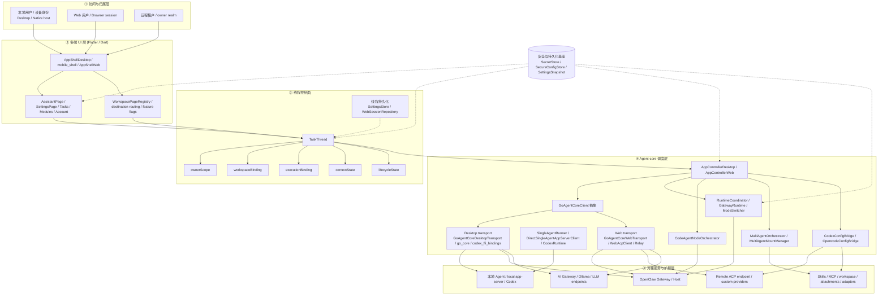
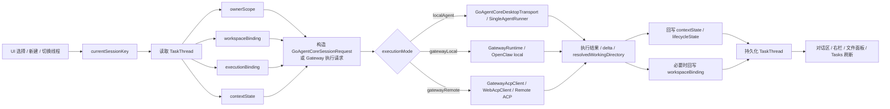

# XWorkmate 整体分层架构

Last Updated: 2026-03-29

## 目的

这份文档不是只画一张“UI 在上、服务在下”的静态框图，而是基于当前仓库代码，
重新规划 XWorkmate 的整体分层架构，回答四个问题：

- 本地用户、Web 用户、远程租户如何进入系统
- 任务线程如何成为 UI 与执行之间的控制面主对象
- Desktop / Mobile / Web 三个界面层如何共用同一套 agent core
- 本地 agent、OpenClaw Gateway、ACP endpoint、AI Gateway、Skills / MCP
  等扩展能力应该落在哪一层

这份文档是整体总览。专题细节仍以以下文档为准：

- `docs/architecture/assistant-thread-target-model-20260328.md`
- `docs/architecture/xworkmate-internal-state-architecture.md`
- `docs/architecture/xworkmate-integrations.md`

## 为什么要重新规划

如果只用“用户 -> UI -> Agent-core -> 服务”四层表达，当前项目里最关键的
一个事实会被隐藏掉：

**XWorkmate 的运行主对象不是某个页面，也不是某个 gateway session，而是
`TaskThread`。**

当前代码里，线程已经有清晰的 canonical schema：

- `ownerScope`
- `workspaceBinding`
- `executionBinding`
- `contextState`
- `lifecycleState`

这意味着整体架构更适合规划成：

1. 访问与归属层
2. 多端 UI 层
3. 线程控制面
4. Agent-core 调度层
5. 对接服务与扩展层
6. 安全与持久化基座（横切，不单独作为主业务层）

推荐的关键判断是：

- UI 不是执行状态真值源
- `TaskThread` 才是线程级控制面真值源
- Agent-core 负责把线程状态翻译成可执行请求
- 真正的 provider / gateway / ACP / Skills / MCP 都应放在 Agent-core 之下

## 整体架构

## 这五层分别是什么

### 1. 访问与归属层

这一层表达“谁在用系统、线程归谁所有”，不是具体页面。

在当前代码里，最接近这层的是：

- Desktop 本地设备身份：`DeviceIdentityStore`
- Web 会话身份与远程持久化身份：`WebSessionPersistenceConfig`
- 线程归属对象：`ThreadOwnerScope`

它的意义是把“用户入口”和“线程归属”从 UI 外观里抽离出来，让后续的
线程绑定、远端工作区路径、租户隔离都围绕 `ownerScope` 来展开。

### 2. 多端 UI 层

这一层只负责交互、展示和编辑，不拥有执行真值。

当前项目对应：

- Desktop shell：`lib/app/app_shell_desktop.dart`
- Mobile shell：`lib/features/mobile/`
- Web shell：`lib/app/app_shell_web.dart`
- 统一页面入口：`WorkspacePageRegistry`
- 页面族：`AssistantPage`、`SettingsPage`、`TasksPage`、`ModulesPage`

重规划后的规则是：

- UI 负责选择线程、展示线程、编辑设置、发起动作
- UI 不直接决定真实工作目录、真实执行模式、真实 provider 绑定
- UI 必须通过 `TaskThread` + `AppController` 读写运行状态

### 3. 线程控制面

这是这次重规划里最重要的一层。

`TaskThread` 应被视为整个 App 的线程级控制面主对象，而不是聊天列表记录。

当前代码里它已经具备完整控制面字段：

- `ownerScope`
- `workspaceBinding`
- `executionBinding`
- `contextState`
- `lifecycleState`

它的职责是：

- 绑定线程归属
- 绑定工作区路径与展示路径
- 绑定执行模式与 provider
- 保存模型、技能、消息、权限、视图模式
- 保存线程的归档与最近执行状态

因此，推荐把所有“切换线程、发消息、切换目标、切换 provider、回写远端目录”
都看成对线程控制面的更新，而不是页面局部状态切换。

### 4. Agent-core 调度层

这是 XWorkmate 的核心中枢。

它不只是“某个 agent SDK”，而是一整套把线程控制面翻译成执行请求的调度层。

当前代码里，这层最关键的组件是：

- `AppControllerDesktop`
- `AppControllerWeb`
- `RuntimeCoordinator`
- `GatewayRuntime`
- `CodeAgentNodeOrchestrator`
- `GoAgentCoreClient`
- `GoAgentCoreDesktopTransport`
- `GoAgentCoreWebTransport`
- `SingleAgentRunner`
- `MultiAgentOrchestrator`
- `MultiAgentMountManager`
- `CodexConfigBridge`
- `OpencodeConfigBridge`

重规划后的职责边界应当是：

- `AppController*` 负责从 `TaskThread` 解析出当前线程的执行上下文
- `GoAgentCoreClient` 负责统一 Desktop / Web 的 agent-core 会话调用抽象
- `RuntimeCoordinator` / `GatewayRuntime` 负责 runtime 与 gateway 连接能力
- `CodeAgentNodeOrchestrator` 负责 app-mediated cooperative node metadata
- `MultiAgentOrchestrator` / `MultiAgentMountManager` 负责协作执行与挂载
- Config bridge 只负责受管配置写入，不越权持有 UI 真值

### 5. 对接服务与扩展层

这一层是实际被调用的执行对象和扩展对象，不应与 controller 混层。

当前代码和文档中，对应的能力面包括：

- 本地单机 agent / local app-server / Codex runtime
- OpenClaw Gateway / Host
- Remote ACP endpoint / 自定义 provider endpoint
- AI Gateway / Ollama / LLM provider
- Skills / MCP / workspace / attachments
- Codex / Claude / Gemini / OpenCode / OpenClaw adapters

重规划后的原则是：

- 新 provider 进入这一层
- 新 gateway 进入这一层
- 新 Skills / MCP / 附件能力进入这一层
- UI 不因为新增 provider 而重新设计页面结构
- 新扩展优先通过 `executionBinding`、transport、adapter、mount manager
  接入，而不是直接打穿到页面

### 6. 安全与持久化基座

它是横切基座，不应抢占主业务层。

当前代码里主要是：

- `SettingsStore`
- `SecretStore`
- `SecureConfigStore`
- `SettingsSnapshot`
- `WebStore`

职责是：

- 持久化线程记录和设置
- 安全保存 secret
- 提供 settings snapshot
- 为 Desktop / Web 各自提供持久化后端

## 线程执行主链路

下面这张图把你给出的“UI 选择线程 -> 读取线程 -> 构造请求 -> 执行 -> 回写”
链路，映射到当前代码里的真实对象。

这条链路里的关键点是：

- UI 先选线程，不是先选 provider
- 线程先绑定，再执行
- 执行模式由 `executionBinding` 决定
- 结果先回写线程，再刷新 UI
- 远端返回新的 working directory 时，应该回写 `workspaceBinding`

## 当前代码里的真实组件映射

| 层级 | 当前主组件 | 代表文件 | 当前职责 |
| --- | --- | --- | --- |
| 访问与归属层 | `ThreadOwnerScope`、`DeviceIdentityStore`、Web session identity | `lib/runtime/runtime_models_runtime_payloads.dart`, `lib/runtime/device_identity_store.dart`, `lib/web/web_session_repository.dart` | 定义线程归属、设备身份、远程会话身份 |
| 多端 UI 层 | `AppShellDesktop`、`mobile_shell_*`、`AppShellWeb`、`AssistantPage`、`SettingsPage` | `lib/app/`, `lib/features/assistant/`, `lib/features/mobile/`, `lib/features/settings/` | 接收用户操作、展示线程与设置 |
| 线程控制面 | `TaskThread` + thread records | `lib/runtime/runtime_models_runtime_payloads.dart`, `lib/runtime/settings_store.dart`, `lib/web/web_session_repository.dart` | 保存线程级真值状态 |
| Agent-core 调度层 | `AppControllerDesktop/Web`、`GoAgentCoreClient`、`RuntimeCoordinator`、`CodeAgentNodeOrchestrator`、`MultiAgentOrchestrator` | `lib/app/`, `lib/runtime/`, `lib/web/` | 把线程状态翻译为执行请求并协调 transport |
| 对接服务与扩展层 | local agent、OpenClaw Gateway、ACP endpoint、AI Gateway、Skills / MCP / adapters | `lib/runtime/go_agent_core_desktop_transport.dart`, `lib/web/go_agent_core_web_transport.dart`, `lib/runtime/multi_agent_mounts.dart` | 真实执行与扩展接入 |
| 安全与持久化基座 | `SettingsStore`、`SecretStore`、`SecureConfigStore`、`WebStore` | `lib/runtime/`, `lib/web/web_store.dart` | 提供持久化与 secret 保护 |

## 三端职责矩阵

| 平台 | UI 入口 | 线程控制面 | agent-core 重点 | 当前执行特点 |
| --- | --- | --- | --- | --- |
| Desktop | `AppShellDesktop` + workspace 页面 | `TaskThread` 持久化最完整 | `AppControllerDesktop` + `RuntimeCoordinator` + Desktop transport | 支持本地 single-agent、gateway local、gateway remote |
| Mobile | `mobile_shell_*` | 复用同一线程模型 | 仍走 native host/controller 体系 | 当前以 remote gateway 场景为主 |
| Web | `AppShellWeb` | 同 schema 的 thread records | `AppControllerWeb` + `GoAgentCoreWebTransport` + relay/acp client | 远程 ACP / relay / AI Gateway 路径 |

## 对你给出的旧图，按代码需要做的三个修正

### 修正 1：`TaskThread` 必须上提成独立控制面

你给的第二张图其实已经接近真实代码主链路了。

真正需要正式化的是：

- `TaskThread` 不是“聊天线程 UI 对象”
- 它应该成为 UI 与调度层之间的唯一线程级真值对象

这也是为什么这次重规划把“线程控制面”单独从 UI 和 runtime 中抽出来。

### 修正 2：`MultiAgentBrokerServer` 目前更适合作为概念 seam，不是已落地的独立主类

现有仓库里没有真正的 `MultiAgentBrokerServer` 实现类。

从代码现实出发，当前更准确的 seam 是：

- `GoAgentCoreClient`
- `GoAgentCoreDesktopTransport`
- `GoAgentCoreWebTransport`
- `GatewayAcpClient`
- `WebAcpClient`
- `MultiAgentOrchestrator`

因此，新的整体架构里应把“broker / ACP / transport”归到 Agent-core 调度层内部，
而不是单独挂成一个与 UI 并列的主系统。

### 修正 3：`Assistant composer / Settings / Feature flags` 属于 UI 层，不属于运行时层

旧图里把 `Assistant composer / Settings / Feature flags` 和 runtime 节点并排。

按代码来看，它们更准确的定位是：

- UI 入口
- 运行时配置编辑器
- 线程动作触发点

它们不应该拥有执行调度职责，只应通过 controller 和线程控制面驱动 runtime。

## 未来扩展时的落点规则

### 新 UI surface

如果未来加新 surface，例如专门的平板布局或独立工作台视图：

- 放在多端 UI 层
- 复用 `TaskThread` 控制面
- 不直接接 provider SDK

### 新执行目标

如果未来新增新的执行目标或新的 gateway 类型：

- 先扩展 `executionBinding`
- 再扩展 `GoAgentCoreClient` transport 或 runtime coordinator
- 不要先改页面分支逻辑

### 新 provider / adapter / MCP / skill capability

如果未来新增 Codex / Claude / Gemini / OpenCode 之外的 provider：

- 放在对接服务与扩展层
- 通过 mount manager、config bridge、ACP endpoint、adapter 接入
- UI 只展示能力，不成为 provider 真值层

### 新租户/归属模型

如果未来要支持团队、项目、组织、设备共享：

- 先扩展 `ThreadOwnerScope`
- 其次扩展远端 `workspaceBinding` 规则
- 不要把租户逻辑散落到页面和 provider 配置里

## 架构结论

结合当前代码和你给的两张图，XWorkmate 最合适的整体定位不是：

- 一个 UI + 若干 provider 接口

而是：

- 一个以 `TaskThread` 为控制面核心的多端 agent workspace App
- UI 负责交互
- 线程控制面负责真值
- Agent-core 负责调度与 transport
- Gateway / ACP / local agent / Skills / MCP 负责实际执行与扩展

一句话概括：

**XWorkmate 应该被设计成“线程先行、界面多端、调度内聚、执行可插拔”的 agent workspace 平台。**

## 相关文档

- `docs/architecture/assistant-thread-target-model-20260328.md`
- `docs/architecture/xworkmate-internal-state-architecture.md`
- `docs/architecture/xworkmate-integrations.md`
- `docs/architecture/assistant-thread-information-architecture.md`
