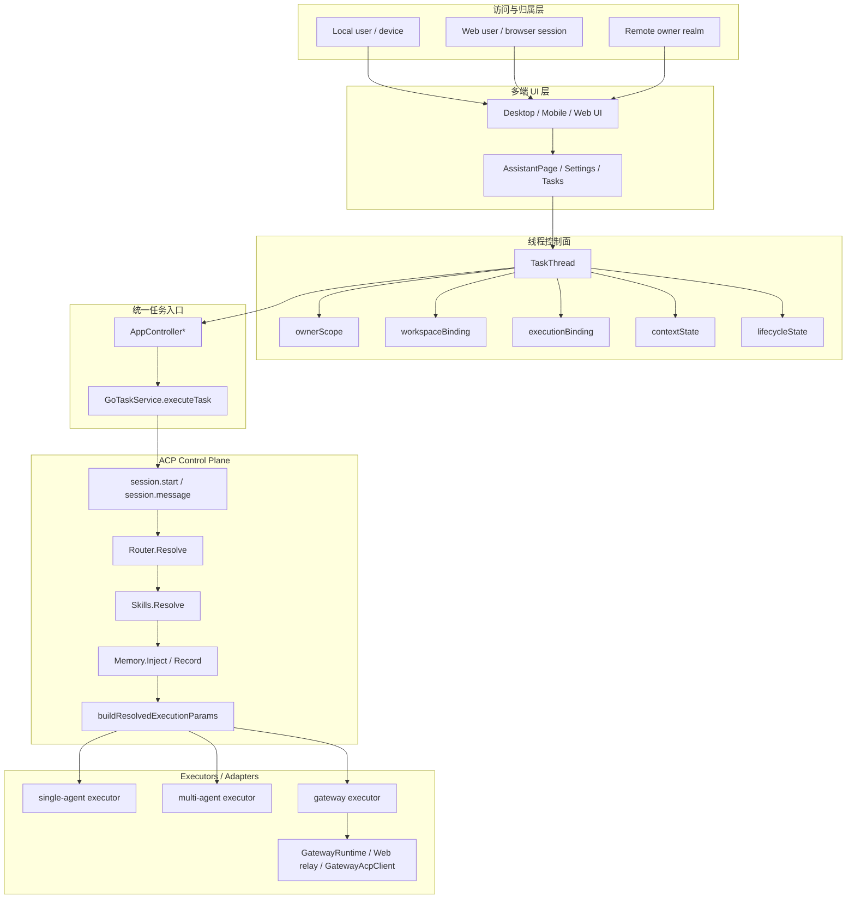

# XWorkmate 整体分层架构

Last Updated: 2026-04-08

## 目的

本文件只保留整体分层总览与目录作用，不再把当前兼容旁路写成长期规范。

统一口径如下：

- `TaskThread` 是线程控制面
- `GoTaskService.executeTask` 是唯一公开执行入口
- ACP 是统一控制面
- `single-agent / multi-agent / gateway` 是 ACP 解析后的执行器分支
- 兼容旁路不再作为架构目标

## 总览图

## 核心规则

1. UI 不直接决定执行 lane。
2. `TaskThread` 承载线程级事实，不由页面局部状态拼装。
3. `GoTaskService.executeTask` 是唯一公开任务入口。
4. ACP 是统一控制面，负责 routing / skills / memory / resolved execution。
5. `gateway` 是执行器分支，不是 UI 旁路目标。

## 文档目录

### 目标规范

- [任务执行链路统一收敛](/Users/shenlan/workspaces/cloud-neutral-toolkit/xworkmate-task-control-plane-unification/docs/architecture/task-control-plane-unification.md)

### 当前实现观察

- 当前实现观察不再保留独立主设计文档
- 如需判断规范，以 [任务执行链路统一收敛](/Users/shenlan/workspaces/cloud-neutral-toolkit/xworkmate-task-control-plane-unification/docs/architecture/task-control-plane-unification.md) 为准

### 边界与适配器说明

- 适配器边界统一收敛到本文件与主文档，不再保留旧的并列设计稿

## Compatibility route (removed from target)

- 旧的 `openClawTask` 公开语义不再是目标架构的一部分
- `GatewayRuntime`、`Web relay`、`GatewayAcpClient` 只作为 adapter/executor 能力存在
