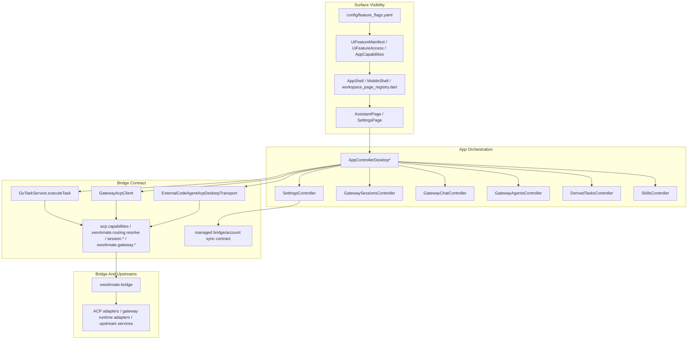

# XWorkmate Layered Architecture

Last Updated: 2026-04-14

## Purpose

本文件只保留当前 `xworkmate-app <-> xworkmate-bridge` 主链的分层总览。

当前仓库已经收敛到：

- 顶层 surface 只有 `assistant`、`settings`
- app 只保留消费 bridge 合同所需的 surface、gate、controller、runtime
- provider catalog、routing、gateway runtime 能力都由 `xworkmate-bridge` 拥有真源
- 已删除独立 `tasks / skills / modules / mcp / claw_hub / secrets / ai_gateway / account` 页面壳与 alias 心智

## Layered View

## Layer Responsibilities

### 1. Surface Visibility

- `feature_flags.yaml` 是 surface 可见性的唯一声明源
- `UiFeatureManifest / AppCapabilities` 负责把声明变成当前平台允许能力
- `AppShell / MobileShell / workspace_page_registry.dart` 只承载已声明且真实存在的 `assistant`、`settings`
- 不再允许“manifest 已删但 shell/registry 还留旧入口”的双重真源

### 2. App Orchestration

- `AssistantPage` 承载当前线程、任务、技能、结果与 bridge 主链交互
- `SettingsPage` 承载 bridge connection、account sync、integration affordance
- app controller 只做最小本地编排，不再维护独立模块壳、假矩阵、旧 alias 分流
- 任务与技能仍可作为 assistant 内部数据面存在，但不再拥有独立页面地位

### 3. Bridge Contract

- `GoTaskService.executeTask` 是 app 任务链的统一公开入口
- `acp.capabilities` 提供 bridge-owned capability snapshot
- `xworkmate.routing.resolve` 返回执行解析结果与 unavailable 信息
- `session.*` 承载 ACP 会话流
- `xworkmate.gateway.*` 承载 gateway runtime 连接与请求流
- 账户同步只同步 bridge 相关配置属性与安全引用，不负责恢复旧模块心智或自动造 catalog

### 4. Bridge And Upstreams

- `xworkmate-bridge` 是 app 唯一公共集成面
- upstream ACP service、gateway runtime、provider adapter 都是 bridge 内部关注点
- app 不直接把 upstream URL、provider topology、gateway backend 细节当成自己的 surface taxonomy

## Canonical Cross-Repo Reading Order

建议按下面顺序理解当前主链：

1. [XWorkmate Core Module Inventory](/Users/shenlan/workspaces/cloud-neutral-toolkit/xworkmate-app/docs/architecture/xworkmate-core-module-inventory-2026-04-13.md)
2. [Task Dialog Provider Selection Mainline](/Users/shenlan/workspaces/cloud-neutral-toolkit/xworkmate-app/docs/architecture/task-dialog-provider-selection-mainline.md)
3. [Task Control Plane Unification](/Users/shenlan/workspaces/cloud-neutral-toolkit/xworkmate-app/docs/architecture/task-control-plane-unification.md)
4. [ACP Forwarding Topology](/Users/shenlan/workspaces/cloud-neutral-toolkit/xworkmate-bridge/docs/architecture/acp-forwarding-topology.md)
5. [ADR: Unified Bridge Entry Points](/Users/shenlan/workspaces/cloud-neutral-toolkit/xworkmate-bridge/docs/architecture/adr-unified-bridge-entrypoints.md)

## Removed From Target

以下内容都不再作为当前目标架构的一部分：

- `Tasks / Skills / Modules / MCP / ClawHub / Secrets / AiGateway / Account` 独立 surface
- 旧 alias destination 与 dormant registry
- app-side provider preset/backfill/fallback 真源
- 把 upstream URL、gateway backend 或 provider 拓扑直接暴露成 app 一级模块心智
