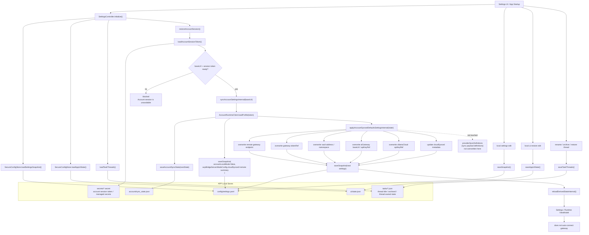

# Settings Config / State / Workflow Redesign

Status: Implementing V1

Date: 2026-04-11

Scope:
- `xworkmate-app`
- Settings / account sync / local UI state / task thread persistence

## V1 Decision

This worktree implements the first app-side simplification:

- keep a single persisted config file: `config/settings.yaml`
- move local recoverable UI state to `ui/state.json`
- keep task title/archive in `tasks/*.json`
- make account sync one-way overwrite for sync-owned fields
- keep bridge provider catalog / runtime capabilities runtime-only

## Overview Workflow

## V1 Boundaries

- `settings.yaml` only stores current schema V1 config intent and sync-owned local snapshots.
- `ui/state.json` stores `assistantLastSessionKey`, `assistantNavigationDestinations`, and `savedGatewayTargets`.
- `tasks/*.json` stores thread-owned display facts such as `title` and `archived`.
- `account/sync_state.json` stores sync metadata only, not local override policy.
- bridge-advertised providers and ACP capability state stay runtime-only.
