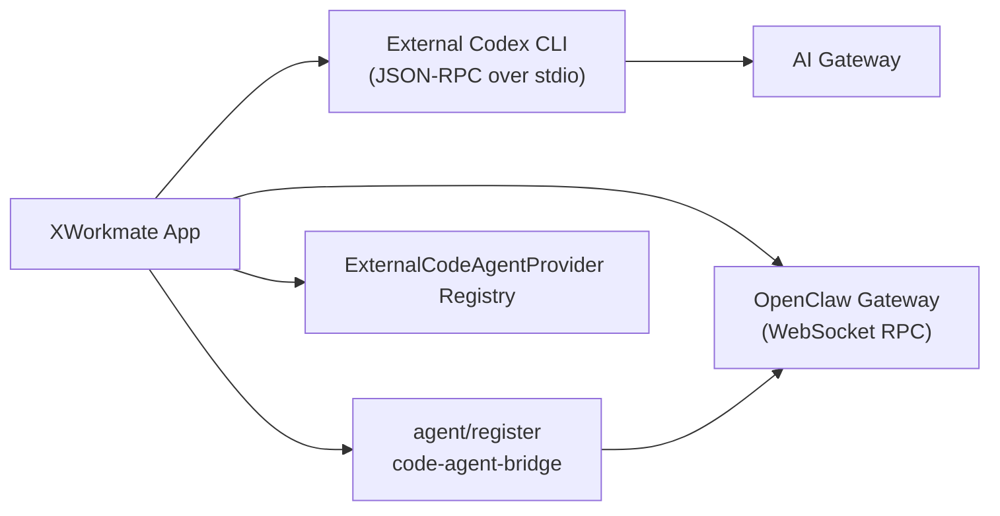

# XWorkmate Codex 集成实际状态

更新时间：2026-03-14

## 当前结论

XWorkmate 当前唯一可交付的 Codex 集成路径是 **External Codex CLI**。

当前已落地的真实链路：

1. 用户在 `设置 > 集成 > AI Gateway > 工具` 显式启用 Bridge。
2. XWorkmate 通过 `CodexConfigBridge` 写入 `~/.codex/config.toml`，把 AI Gateway 暴露给 Codex。
3. XWorkmate 通过 `CodexRuntime.startStdio()` 拉起外部 `codex app-server --listen stdio://`。
4. XWorkmate 通过 `CodeAgentNodeOrchestrator` 生成 app-mediated node dispatch metadata，并在 `chat.send` 时发送给 OpenClaw Gateway。
5. 如果 OpenClaw Gateway 已连接，XWorkmate 会执行一次 `agent/register`，把自己注册为协同 `code-agent-bridge`。

这意味着当前架构是 **app-mediated RPC bridge**，不是 `Codex CLI` 和 `OpenClaw Gateway` 直接互连。

## 已完成

### 1. External Codex CLI 协同模式

- `SettingsSnapshot.codeAgentRuntimeMode` 已加入持久化模型，默认值为 `externalCli`
- `SettingsSnapshot.codexCliPath` 已加入持久化模型，用于外部 Codex 二进制路径覆盖
- `AppController.enableCodexBridge()` 已改为显式执行完整链路：
  - 校验 AI Gateway 配置
  - 导出 Codex bridge 配置
  - 启动外部 Codex CLI 进程
  - Gateway 已连接时执行 `agent/register`
- `AppController.sendChatMessage()` 已不再直接裸调 Gateway chat，而是先构造 app-mediated node dispatch envelope
- Gateway 不可用时，Bridge 会降级为本地运行，外部 Codex 进程不会因为注册失败而被终止
- `AgentRegistry.register()` 已支持真实 `transport` metadata，不再把外部桥接伪装成固定 `in-process`

### 2. 外部 CLI 预留能力

- `RuntimeCoordinator` 继续维护 `ExternalCodeAgentProvider` registry
- `CodeAgentNodeOrchestrator` 已成为 App -> Gateway 的统一 dispatch metadata builder
- Codex 已通过同一套 provider surface 暴露：
  - `id = codex`
  - `command`
  - `defaultArgs`
  - capability metadata

当前仍然只有一个 active provider：`codex`。

### 3. UI 与 truth 收口

- Codex 区域已从“仅导出配置”改成 bridge control panel
- 界面现在展示：
  - 运行时模式
  - binary 检测状态
  - 手动路径覆盖
  - bridge 状态
  - Gateway 协同注册状态
- `builtIn` 仍保留在 enum 中，但 UI 只显示为 `Experimental`
- 若用户选择 `builtIn`，设置会被保留，并以实验态提示风险
- Scheduled Tasks 页面明确为 `cron.list` 只读展示
- Memory 只表述为 `memory/sync` 同步能力，不宣传 CRUD
- OpenClaw Gateway 看到的是 `XWorkmate App node`，CLI 仍保持在 App 后端 runtime 边界内

## 未完成

### 1. Built-in Codex / Rust FFI

仍未完成，且当前不应作为已交付能力对外承诺。

现状：

- `rust/src/lib.rs` 仍保留消息发送和事件轮询 TODO
- `rust/src/runtime.rs` 仍保留进程启动和停止 TODO
- Flutter 侧的 `builtIn` 只是保留枚举位，不会实际走可用 FFI 路径

### 2. 其他外部 Provider 的通用选择与调度

当前只完成 registry 和 capability metadata 预留，没有做：

- provider chooser UI
- capability discovery UI
- 多 provider 调度策略

这些能力要等第二个真实 provider 落地后再补。

### 3. OpenClaw Tasks / Memory 深度能力

当前只到 truth-first 范围：

- Scheduled Tasks：`cron.list` 只读
- Memory：`memory/sync` only

当前没有：

- 创建 / 删除 cron job 的 UI
- 通用任务调度写接口
- 记忆的 store / retrieve / list / delete 产品化界面

## 当前架构

## 交付判断

截至 2026-03-14，可对外宣称的能力只有：

- External Codex CLI bridge
- AI Gateway 模型桥接
- OpenClaw Gateway 协同注册
- External provider registry 预留

不能宣称的能力：

- Built-in Codex 已可用
- Rust FFI 已完成
- Scheduled Tasks 已支持增删改
- Memory 已支持完整 CRUD
