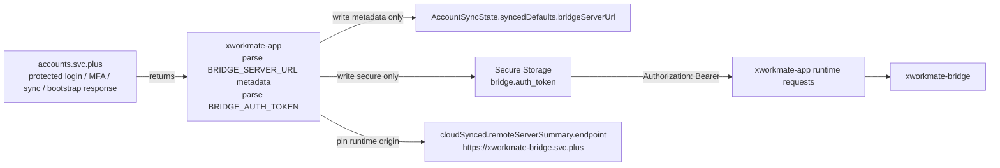
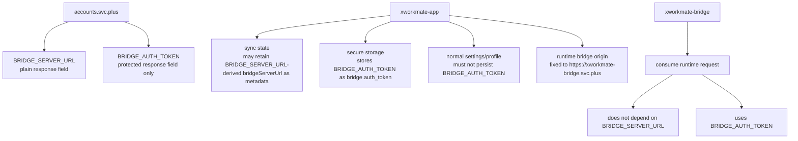
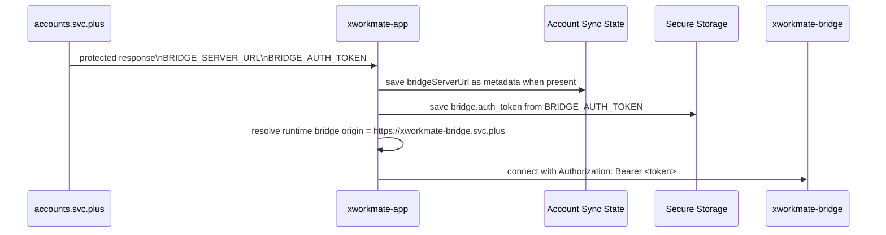
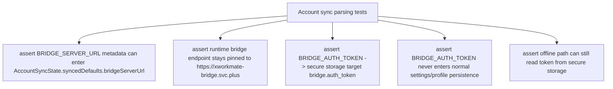

# Bridge Sync Contract Chain

## Scope

This note documents the account-driven bridge sync chain after the naming unification to:

- `BRIDGE_SERVER_URL`
- `BRIDGE_AUTH_TOKEN`

It focuses on the runtime data path:

- `accounts.svc.plus`
- `xworkmate-app`
- `xworkmate-bridge`

and the two key client-side parsing assertions:

- `BRIDGE_SERVER_URL` may be retained in account sync metadata, but does not drive runtime endpoint selection
- `BRIDGE_AUTH_TOKEN` is written into secure storage
- account sync no longer parses `INTERNAL_SERVICE_TOKEN` as a bridge token fallback

## Sync Chain

## Field Ownership

## Parsing And Persistence Checks

## Test Coverage Targets

## Expected Invariants

- Runtime bridge endpoint selection must not depend on `BRIDGE_SERVER_URL`.
- The app-facing managed bridge origin is fixed to `https://xworkmate-bridge.svc.plus`.
- `BRIDGE_SERVER_URL`, when present, is metadata only.
- `BRIDGE_AUTH_TOKEN` is the only bridge token field used by the sync contract.
- `INTERNAL_SERVICE_TOKEN` is not part of the app-side account sync token contract.
- `BRIDGE_AUTH_TOKEN` must never be written into normal settings snapshot, profile JSON, or UI-visible text.
- Client requests must assemble the header as `Authorization: Bearer <token>`.
